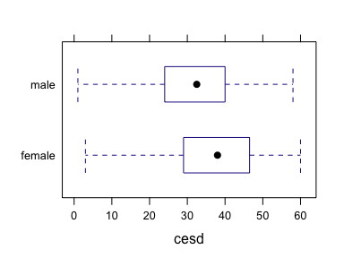
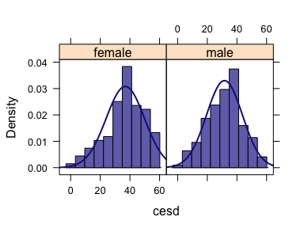

Week 10: Comparing Two Populations Using Independent Samples
================
written by Junvie Pailden

### Load the required package for this lesson.

``` r
library(mosaic) # load the package mosaic
```

### Descriptive comparison of two populations in R

We will illustrate these using the CESD (Center for Epidemiologic Studies–Depression) measure of depressive symptoms (which takes on values between 0 and 60, with higher scores indicating more depressive symptoms). The data set `HELPrct` is included in the `mosaic` package.

Here we will compare the distributions of CESD scores by sex. The `mean()` function can be used to calculate the mean CESD score separately for males and females (two populations).

``` r
mean(~ cesd, data = HELPrct) # overall sample mean CESD score
# [1] 32.8
mean(cesd ~ sex, data = HELPrct) # sample mean CESD score by gender (two populations)
# female   male 
#   36.9   31.6
```

We can use the `favstats` function to provide a more comprehensive (more statistics) sample information by groups.

``` r
favstats(cesd ~ sex, data = HELPrct)
#      sex min Q1 median   Q3 max mean   sd   n missing
# 1 female   3 29   38.0 46.5  60 36.9 13.0 107       0
# 2   male   1 24   32.5 40.0  58 31.6 12.1 346       0
```

Boxplots and histograms are helpful visual guides to compare both samples (especially with large sample sizes).

``` r
bwplot(sex ~ cesd, data = HELPrct)
```



``` r
histogram(~ cesd | sex, data = HELPrct, fit = "normal")
```



Notice that both sample groups are relative large (`n1 = 107` and `n2 = 346`) and with sample distribution shapes that are relatively symmetric.

Inferences on differences between two population means
------------------------------------------------------

We consider using sample data to compare two population populations through their population means. An investigator may wish to estimate the difference between two population means or to test hypotheses about this difference. For example, a researcher compares whether the mean CESD scores for Female subjects is different from Male subjects. Here, two populations (Females and Males) are to be compared on the basis on the basis of the respective mean CESD score. Information from two random samples, one from each gender group, could be used to make such a comparison.

| Population | Mean  | Standard Deviation |
|------------|-------|--------------------|
| 1          | `mu1` | `sigma1`           |
| 2          | `mu2` | `sigma2`           |

A comparison of means focuses on the difference, `mu1 - mu1`. The two population means are identical `(mu1 = mu2)` when `mu1 - mu1 = 0`. Similarly , `mu1 > mu2` when `mu1 - mu2 > 0` and `mu1 < mu1` when `mu1 - mu2 < 0`.

### Comparison of the means using hypothesis tests

When comparing two populations means, we conventionally test the null hypothesis (`Ho`) of the form
`Ho : mu1 - mu2 = hypothesized value`
where the `hypothesized value` is the hypothesized or claimed mean difference (often set to be 0).

The alternative hypothesis (`Ha`) involves the same `hypothesized value` but uses one of three inequalities (less than, greater than, or not equal to).

For example, suppose `mu1` and `mu2` denote the mean CESD score in Females and Males, respectively. The hypotheses we may be testing are
`Ho: mu1 - mu2 = 0   versus   Ha: mu1 - mu2 /= 0`.

The null hypothesis (`Ho`) is equivalent to the claim that the mean CESD score for Females and Males are equal. The alternative hypothesis (`Ha`) states Females and Males have different mean CESD scores.

### Two-sample Student's t procedure in R

    t.test( variable ~ group, # formula interface
       alternative = c("two.sided", "less", "greater"), # default = "two.sided""
       mu = 0, # hypothesized mean difference, default = 0
       var.equal = FALSE, # default = FALSE
       conf.level = 0.95,  # change confidence level as needed, default = 0.95
       data = DATA # specify data frame
       )

The Student's two sample t-test can be run without (`sigma1 not equal sigma2` - default) or with an equal variance (`sigma1 equal sigma2`) assumption. We use `t.test()` function, first described in the previous lesson, with a formula interface (`variable ~ group`) and an extra Boolean argument (`var.equal`) indicating which variance assumption to use.

``` r
# equal variance assumption
t.test(cesd ~ sex,  
       var.equal = TRUE, 
       alternative = "two.sided",
       data = HELPrct)
# cesd ~ sex
# 
#   Two Sample t-test
# 
# data:  cesd by sex
# t = 4, df = 500, p-value = 1e-04
# alternative hypothesis: true difference in means is not equal to 0
# 95 percent confidence interval:
#  2.61 7.97
# sample estimates:
# mean in group female   mean in group male 
#                 36.9                 31.6
```

From the output, we see that:

-   The value of the t-statistic is `t = 4`.
-   The t-statistic is approximately distributed as Student's t with degree of freedom `df = 500` under the assumption of equal population means.
-   The two-sided p-value is 0.0001, so there is significant difference that the mean CESD scores are different.
-   The 95% confidence interval for the difference in mean CESD scores is (2.61, 7.97).

In short, we see that there is a statistically significant difference in mean CESD scores between Female and Male subjects.

We can repeat the procedure using the unequal variance assumption.

``` r
# unequal variance assumption
t.test(cesd ~ sex, 
       var.equal = FALSE, 
       alternative = "two.sided",
       data = HELPrct)
# cesd ~ sex
# 
#   Welch Two Sample t-test
# 
# data:  cesd by sex
# t = 4, df = 200, p-value = 3e-04
# alternative hypothesis: true difference in means is not equal to 0
# 95 percent confidence interval:
#  2.49 8.09
# sample estimates:
# mean in group female   mean in group male 
#                 36.9                 31.6
```

From the output, we see that: \* The value of the t-statistic is `t = 4` which is same as that of the equal variance assumption. \* Using Welch procedure for unequal variance assumption, the t-statistic is approximately distributed as Student's t with degree of freedom `df = 200` under the assumption of equal population means. \* The two-sided p-value is 0.0003 - same statistical significant difference in the means. \* The 95% confidence interval for the difference in mean CESD scores is (2.49, 8.09) which is slightly wider than the when using the equal variance assumption.

------------------------------------------------------------------------

### `t.test()` without formula interface

We can also use `t.test()` function without the formula interface format. Consider the following example:

6 subjects were given a drug (treatment group) and an additional 6 subjects a placebo (control group). Their reaction time to a stimulus was measured (in ms). We want to perform a two-sample t-test for comparing the means of the treatment and control groups.

Specifically, we want to test the alternative hypothesis that the mean reaction time in the Control group is less than the Treatment group.

``` r
Control <- c(91, 87, 99, 77, 88, 91)
Treat <- c(101, 110, 103, 93, 99, 104)
t.test(Control, Treat, # specify data for each sample
       alternative = "less", 
       var.equal = TRUE)
# 
#   Two Sample t-test
# 
# data:  Control and Treat
# t = -3, df = 10, p-value = 0.003
# alternative hypothesis: true difference in means is less than 0
# 95 percent confidence interval:
#   -Inf -6.08
# sample estimates:
# mean of x mean of y 
#      88.8     101.7
```

------------------------------------------------------------------------
