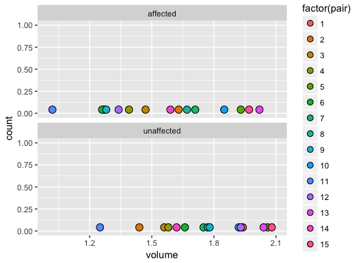
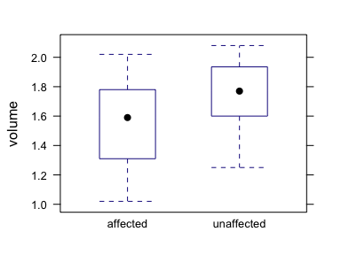

Week 11: Analysis on Paired Data
================
written by Junvie Pailden

### Load the required packages for this lesson.

``` r
# install the necessary package if it doesn't exist
if (!require(mosaic)) install.packages(`mosaic`)
if (!require(dplyr)) install.packages(`dplyr`)
# load the packages
library(mosaic)
library(dplyr)
```

Paired Data
-----------

Paired data occurs in many ways. Some studies involve using the same group of individuals with measurements recorded both before and after some intervening treatment. Other studies might use naturally occurring pairs, such as twins or husband and wives, and some construct pairs by matching on some known factors. Because the pairs are similar, any difference in the target variable might be due to the intervening treatment only. Hence, many researchers agree that paired samples often provide more insight and information than two independent samples.

**Example:** For decades it's been suspected that schizophrenia involves anatomical abnormalities in the hippocampus, an area of the brain involved with memory. The following data bearing on this issue are from Suddath et al. (1990) and were used by Ramsey and Schafer (3rd ed., 2013, p. 31. Display 2.2). The researchers obtained MRI measurements of the volume of the left hippocampus from 15 pairs of identical twins discordant for schizophrenia, i.e, one the twin is affected with schizophrenia. The data are displayed in the following table.

``` r
schizophrenia <- read.table(header = T, text="
pair   affected   unaffected
1      1.27       1.94
2      1.63       1.44
3      1.47       1.56
4      1.39       1.58
5      1.93       2.06
6      1.26       1.66
7      1.71       1.75
8      1.67       1.77
9      1.28       1.78
10     1.85       1.92
11     1.02       1.25
12     1.34       1.93
13     2.02       2.04
14     1.59       1.62
15     1.97       2.08
")

mean(~ affected, data = schizophrenia)
# [1] 1.56
sd(~ affected, data = schizophrenia)
# [1] 0.301
mean(~ unaffected, data = schizophrenia)
# [1] 1.76
sd(~ unaffected, data = schizophrenia)
# [1] 0.242
```

Performing a two-sample t-test on a paired data might give incorrect or inconclusive results since the analysis ignores the information about how the sample units are paired. Check last weeks ([Week 10](https://github.com/jpailden/rstatlab/blob/master/week10.md)) lesson for an example of two-sample analysis.

``` r
# two-sample t-test
t.test(schizophrenia$affected,  schizophrenia$unaffected,
       conf.level = 0.95,
       mu = 0) # claimed difference
# 
#   Welch Two Sample t-test
# 
# data:  schizophrenia$affected and schizophrenia$unaffected
# t = -2, df = 30, p-value = 0.06
# alternative hypothesis: true difference in means is not equal to 0
# 95 percent confidence interval:
#  -0.40361  0.00627
# sample estimates:
# mean of x mean of y 
#      1.56      1.76
```

The two-sample analysis above gives a 95% confidence interval on the mean skull volume difference that contains zero. Equivalently, the two-sample t-test procedure provides a p-value larger than the typical 5% level of significance. This means that, *without using the natural pairing of the units (twins) in the sample*, we found inconclusive evidence on whether the mean skull volumes between the affected and unaffected are different.

The graph below plots the skull volume measurements (affected and unaffected) with colors corresponding to pair of twins. Notice that some twins have marked difference in skull volume measurements (e.g. pair 11 and pair 4) which lead us to suspect a possible difference in the skull measurements after using the information about sample pairing.



Differences in Paired Samples
-----------------------------

When dealing with paired data, inferences should be based on the differences between two observations within each sample pair. The `n` sample differences can then be regarded as having been selected from a large population of differences.

Inferences, similar to one-sample t-test, are now performed in the `n` sample differences.

``` r
# add a column containing the paired difference
schizophrenia <- schizophrenia %>% 
  mutate(d = affected - unaffected) # use mutate function to add computed column
histogram(~ d, data = schizophrenia)
```


``` r
# sample average differences
mean(~ d, data = schizophrenia)
# [1] -0.199
# sample standard deviation of the differnces
sd(~ d, data = schizophrenia)
# [1] 0.238
```

Assuming that the sample paired-differences `d` comes from a normal distribution, we can perform a paired-sample t.test analysis using the `t.test` function.

``` r
# t.test function with claimed difference equal to zero
t.test(schizophrenia$d, 
       conf.level = 0.95,
       mu = 0) # assign different value of mu if claimed difference is nonzero
# 
#   One Sample t-test
# 
# data:  schizophrenia$d
# t = -3, df = 10, p-value = 0.006
# alternative hypothesis: true mean is not equal to 0
# 95 percent confidence interval:
#  -0.3306 -0.0667
# sample estimates:
# mean of x 
#    -0.199
```

After accounting for the paired unit information, the paired t-test suggest a strong evidence that the mean skull measurements between twin subjects with schizophrenia and without schizophrenia are different. In fact, the mean skull volume for the affected is significantly smaller than the unaffected.

Equivalently, we can also run the paired sample analysis without first getting the paired difference `d` by providing the argument `paired = TRUE` in the `t.test` function.

``` r
t.test(schizophrenia$affected, schizophrenia$unaffected,
       paired = TRUE,
       conf.level = 0.95,
       mu = 0)
# 
#   Paired t-test
# 
# data:  schizophrenia$affected and schizophrenia$unaffected
# t = -3, df = 10, p-value = 0.006
# alternative hypothesis: true difference in means is not equal to 0
# 95 percent confidence interval:
#  -0.3306 -0.0667
# sample estimates:
# mean of the differences 
#                  -0.199
```

Wide and Long Data
------------------

Many functions in `R` expect data to be in a long format rather than a wide format. The `schizophrenia` data set above, where the columns represent the `paired unit` and separate columns for volume measurements under `affected` and `unaffected`, is an example of wide format. The equivalent `schizophrenia` data below, where each variable forms a column and each observation (individual) forms a row, is an example of a long format.

``` r
long.schz
#    pair       twin volume
# 1     1   affected   1.27
# 2     2   affected   1.63
# 3     3   affected   1.47
# 4     4   affected   1.39
# 5     5   affected   1.93
# 6     6   affected   1.26
# 7     7   affected   1.71
# 8     8   affected   1.67
# 9     9   affected   1.28
# 10   10   affected   1.85
# 11   11   affected   1.02
# 12   12   affected   1.34
# 13   13   affected   2.02
# 14   14   affected   1.59
# 15   15   affected   1.97
# 16    1 unaffected   1.94
# 17    2 unaffected   1.44
# 18    3 unaffected   1.56
# 19    4 unaffected   1.58
# 20    5 unaffected   2.06
# 21    6 unaffected   1.66
# 22    7 unaffected   1.75
# 23    8 unaffected   1.77
# 24    9 unaffected   1.78
# 25   10 unaffected   1.92
# 26   11 unaffected   1.25
# 27   12 unaffected   1.93
# 28   13 unaffected   2.04
# 29   14 unaffected   1.62
# 30   15 unaffected   2.08
```

The `t.test` function can perform analysis on the long format version using formula interface. The paired `t.test` for the `schizophrenia` data is shown below. See [Week 10 laboratory lesson](https://github.com/jpailden/rstatlab/blob/master/week10.md) for an example on two-independent sample analysis.

``` r
# boxplot
bwplot(volume ~ twin, data = long.schz)
```



``` r
# sample mean volume
mean(volume ~ twin, data = long.schz)
#   affected unaffected 
#       1.56       1.76
# sample standard deviation of volume
sd(volume ~ twin, data = long.schz)
#   affected unaffected 
#      0.301      0.242
t.test(volume ~ twin, data = long.schz, 
       paired = TRUE,
       conf.level = 0.95,
       mu = 0)
# volume ~ twin
# 
#   Paired t-test
# 
# data:  volume by twin
# t = -3, df = 10, p-value = 0.006
# alternative hypothesis: true difference in means is not equal to 0
# 95 percent confidence interval:
#  -0.3306 -0.0667
# sample estimates:
# mean of the differences 
#                  -0.199
```
