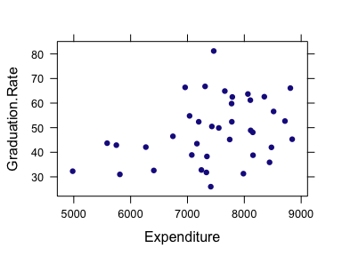
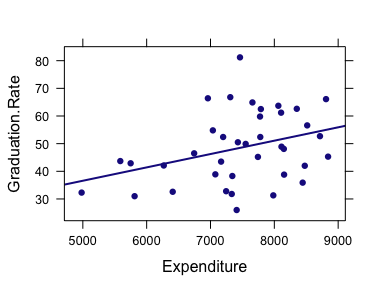
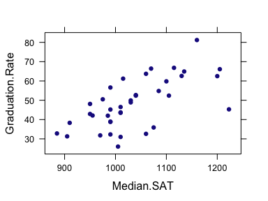
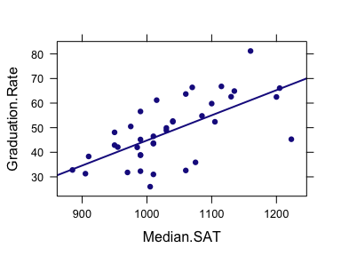

Week 12: Describing Relationships Between Quantitative Variables
================
written by Junvie Pailden

### Load the required packages for this lesson.

``` r
# install the necessary package if it doesn't exist
if (!require(mosaic)) install.packages(`mosaic`)
# load the packages
library(mosaic)
```

Modeling Graduate Rates
-----------------------

Consider the data below on six-year graduation rate (%), student-related expenditure per full-time student, and median SAT score for the 38 primarily undergraduate public universities and colleges in the United States with enrollments between 10,000 and 20,000.

``` r
gradrates <- read.csv("https://www.siue.edu/~jpailde/gradrates.csv")
gradrates
#    Graduation.Rate Expenditure Median.SAT
# 1             81.2        7462       1160
# 2             66.8        7310       1115
# 3             66.4        6959       1070
# 4             66.1        8810       1205
# 5             64.9        7657       1135
# 6             63.7        8063       1060
# 7             62.6        8352       1130
# 8             62.5        7789       1200
# 9             61.2        8106       1015
# 10            59.8        7776       1100
# 11            56.6        8515        990
# 12            54.8        7037       1085
# 13            52.7        8715       1040
# 14            52.4        7780       1040
# 15            52.4        7198       1105
# 16            50.5        7429        975
# 17            49.9        7551       1030
# 18            48.9        8112       1030
# 19            48.1        8149        950
# 20            46.5        6744       1010
# 21            45.3        8842       1223
# 22            45.2        7743        990
# 23            43.7        5587       1010
# 24            43.5        7166       1010
# 25            42.9        5749        950
# 26            42.1        6268        955
# 27            42.0        8477        985
# 28            38.9        7076        990
# 29            38.8        8153        990
# 30            38.3        7342        910
# 31            35.9        8444       1075
# 32            32.8        7245        885
# 33            32.6        6408       1060
# 34            32.3        4981        990
# 35            31.8        7333        970
# 36            31.3        7984        905
# 37            31.0        5811       1010
# 38            26.0        7410       1005
```

Let's start by summarizing the data by computing all relevant one-sample statistics for each variable.

``` r
favstats(~ Graduation.Rate, data = gradrates)
#  min   Q1 median Q3  max mean   sd  n missing
#   26 38.8   47.3 59 81.2 48.5 12.9 38       0
favstats(~ Expenditure, data = gradrates)
#   min   Q1 median   Q3  max mean  sd  n missing
#  4981 7098   7506 8110 8842 7461 919 38       0
favstats(~ Median.SAT, data = gradrates)
#  min  Q1 median   Q3  max mean   sd  n missing
#  885 990   1012 1082 1223 1036 81.9 38       0
```

### Scatterplots and Simple Linear Regression

We can use the `xyplot` function under the `mosaic` to create scatterplots between quantitative variables. Adding an extra argument `type = c("p", "r")` superimposes a regression line on top of the points in the plot.

``` r
xyplot( dependent.var ~ independent.var,  # assign variables  
       data = DATA, # data set
       type = c("p", "r"), # add regression line
       )
```

The graph below displays scatterplots of graduation rate versus student-related expenditure and graduation rate versus median SAT score. It seems that there is a linear relationship between the variables so its wise to fit a regression line to summarize these relationships.

``` r
xyplot(Graduation.Rate ~ Expenditure, 
       data = gradrates)
```



``` r
# add a regression line
xyplot(Graduation.Rate ~ Expenditure, 
       data = gradrates,
       type = c("p", "r"))
```



``` r
xyplot(Graduation.Rate ~ Median.SAT, 
       data = gradrates)
```



``` r
# add a regression line
xyplot(Graduation.Rate ~ Median.SAT, 
       data = gradrates,
       type = c("p", "r"))
```



Notice that the points on the scatterplot of `graduation rate versus median SAT score` seems to hug the regression line better than the points on the scatterplot of `graduation rate versus student-related expenditure`. This visual feature (how well the line fits the data) summarizes how two variables are strongly related with each other. We will describe a measure that quantifies the strength of this relationship.

We can compute the equation of the regression line using the command `lm`.

``` r
model1 <- lm(Graduation.Rate ~ Expenditure, 
       data = gradrates)
model1
# 
# Call:
# lm(formula = Graduation.Rate ~ Expenditure, data = gradrates)
# 
# Coefficients:
# (Intercept)  Expenditure  
#    12.41357      0.00483
model2 <- lm(Graduation.Rate ~ Median.SAT, 
       data = gradrates)
model2
# 
# Call:
# lm(formula = Graduation.Rate ~ Median.SAT, data = gradrates)
# 
# Coefficients:
# (Intercept)   Median.SAT  
#     -57.433        0.102
```

The equation of the estimated regression line that describes the relationship of `graduation rate versus student-related expenditure` is `y = 12.414 + 0.005x`. From this equation, we can say that graduation rate (on average) increases by .005 percent for every dollar increase in student expenditure. Equivalently, we say that graduation rate (on average) increases by 5 percent (.005 x 1000) for every 1000 dollars increase in student expenditure.

On the other hand, the equation of the estimated regression line that describes the relationship of `graduation rate versus median SAT score` is `y = -57.433 + 0.102x`. We can say that graduation rate (on average) increases by .102 percent for every point increase in median SAT score. Equivalently, we say that graduation rate (on average) increases by 5.1 percent (.102 x 50) for every 50 point increase in median SAT score.

In other words, simple regression analysis on graduation rates of public universities and colleges in this data increases (on average) by 5% when either student-related expenditure increases by 1000 dollars or when median SAT score increases by 50 points.

### Correlation Coefficient and Coefficient of Determination

We can compute linear correlations between pairs of quantitative variables, or for a matrix of quantitative variables using the function `cor`.

``` r
# `with` command another way to select variables, for use in computations, within a data set  
with(gradrates, cor(Graduation.Rate, Expenditure))
# [1] 0.344
# or, using the `$` way of calling a variable in a data 
cor(gradrates$Graduation.Rate, gradrates$Expenditure)
# [1] 0.344
# correlation for a matrix of variables
cor(gradrates)
#                 Graduation.Rate Expenditure Median.SAT
# Graduation.Rate           1.000       0.344      0.649
# Expenditure               0.344       1.000      0.320
# Median.SAT                0.649       0.320      1.000
```

The estimated linear correlation between `graduation rate versus expenditure` is 0.344 while the estimated linear correlation between `graduation rate versus median SAT score` is 0.649.

There is positive (direct or increasing) linear relationship between graduation rates versus expenditure and median SAT score. Also, it seems that median SAT score is more strongly related to graduation rates than student expenditure.

The coefficient of determination `R2` is a natural extension to correlation coefficients as measures of quantitative relationships. `R2` is computed by squaring the estimated correlation values. `R2` also plays an important role in regression analysis since it describes the proportion of variation in the dependent variable that the regression model was able to capture.

We can compute the coefficient of determination `R2` in multiple ways in R as shown below.

``` r
# coefficient of determination
cor(gradrates)^2
#                 Graduation.Rate Expenditure Median.SAT
# Graduation.Rate           1.000       0.119      0.421
# Expenditure               0.119       1.000      0.102
# Median.SAT                0.421       0.102      1.000
# using lm output model1 for gradrates vs expenditure
summary(model1)$r.squared
# [1] 0.119
# using lm output model2 for gradrates vs SAT score
summary(model2)$r.squared
# [1] 0.421
```

The estimated coefficient of determination `R2` for `graduation rate versus median SAT score` is 0.421 while that for `graduation rate versus expenditure` is 0.119.

Notice that that the regression model when using median SAT score as independent variable was able to capture more variation in graduation rates than when using student expenditure as independent variable. This observation also supports our initial observation earlier when looking at the fitted regression line in the scatterplots.

------------------------------------------------------------------------
