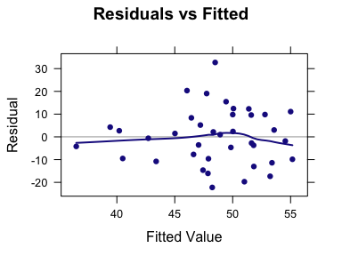
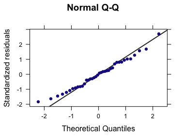

Week 13: Simple Linear Regression Analysis in R
================
written by Junvie Pailden

### Load the required packages for this lesson.

``` r
# install the necessary package if it doesn't exist
if (!require(mosaic)) install.packages(`mosaic`)
# load the packages
library(mosaic)
```

### Checking the Basic Regression Assumptions

Recall the data used in Week 12 to model six-year graduation rate (%) using the predictors student-related expenditure per full-time student, and median SAT score for the 38 primarily undergraduate public universities and colleges in the United States with enrollments between 10,000 and 20,000.

``` r
gradrates <- read.csv("https://www.siue.edu/~jpailde/gradrates.csv")
str(gradrates)
# 'data.frame': 38 obs. of  3 variables:
#  $ Graduation.Rate: num  81.2 66.8 66.4 66.1 64.9 63.7 62.6 62.5 61.2 59.8 ...
#  $ Expenditure    : int  7462 7310 6959 8810 7657 8063 8352 7789 8106 7776 ...
#  $ Median.SAT     : int  1160 1115 1070 1205 1135 1060 1130 1200 1015 1100 ...
```

Let's consider, for the moment, only the predictor student expenditure `Expenditure` to model the six year graduation rates using a simple regression line.

``` r
xyplot(Graduation.Rate ~ Expenditure, 
       data = gradrates,
       type = c("p", "r"))
```


``` r
model1 <- lm(Graduation.Rate ~ Expenditure, 
       data = gradrates)
model1
# 
# Call:
# lm(formula = Graduation.Rate ~ Expenditure, data = gradrates)
# 
# Coefficients:
# (Intercept)  Expenditure  
#    12.41357      0.00483
```

The fitted regression line is: `Graduation.Rate = 12.4136 + 0.0048*Expenditure`. According to this model the average six year graduation rate increases by 0.0048 percent for each additional dollar increase in student expenditure. Equivalently, the average six year graduation rate increases by 2.4 (0.0048\*500) percent for each additional 500 dollar increase in student expenditure.

Notice from the graph above that the simple regression model tends to fit better at low student expenditure values than at higher student expenditure values. In practice, it is easier to analyze the regression model errors using a residual plot.

We define the residuals as the vertical distances from the observed (response) graduation rate `Graduation.Rate` to the fitted regression line. The residual plot is a scatterplot of the residuals and the fitted response values.

The `mplot()` function can facilitate creating a variety of useful plots, including the residuals vs. fitted value scatterplots, by specifying the `which = 1` option.

``` r
mplot(model1, which = 1)
# [[1]]
```



We can see from the residual plot that the residuals are closer to zero at low student expenditure values (or low graduation rates); the variance is not constant across all student expenditure (or graduation rates), but increasing with student expenditure (spread around the horizontal axis in the residual plot).

> Inference (tests or confidence intervals) about the model is usually based on the assumption that the errors are normally distributed with mean zero and constant variance. Checking whether the error (estimated by the residuals) has zero mean and constant variance is often done visually using a residual plot.

We can also the `mplot()` function check the normality of the errors visually using a normal quantile-quantile plot (QQplot, check [Week 9](https://github.com/jpailden/rstatlab/blob/master/week9.md)) by using the argument `which = 2`.

``` r
mplot(model1, which = 2)
# [[1]]
```



The QQplot above indicates that the normality assumption seems to be valid for the error in the simple regression model on graduation rates using student expenditure as predictor.

------------------------------------------------------------------------

Inferences on the regression slope
----------------------------------

### Confidence interval for the slope

When the assumptions of the simple linear regression model are satisfied, a confidence interval for the slope of the population regression line has the form

> (`estimated slope`) +/- (`t critical value`) x (`standard error`)

We can use the function `confint()` to construct confidence intervals for the intercept and the slope. We are mainly interested in the estimated slope interval.

``` r
confint(model1)  # default 95% confidence interval
#                 2.5 %   97.5 %
# (Intercept) -2.11e+01 45.90326
# Expenditure  3.79e-04  0.00929
confint(model1, level = 0.99)  # 90% confidence interval
#                 0.5 %  99.5 %
# (Intercept) -32.49296 57.3201
# Expenditure  -0.00114  0.0108
```

The 99% confidence interval for the slope is (-0.00114, 0.0108). From this interval, we can say zero is a plausible value for the population regression slope on student expenditure as predictor of graduation rates. Hence, it is possible that student expenditure has no influence on the behavior of graduation rates.

### Hypothesis testing for the slope

The model utility test for simple linear regression is the test of `Ho: beta = 0` versus `Ha: beta not equal to 0`. The null hypothesis specifies that there is no useful linear relationship between the predictor `x` and the response `y`. If `Ho` is rejected in favor of `Ha`, we conclude that the simple linear regression model is useful for predicting the response `y`.

We can use the summary functions `summary` or `msummary` to see the tests statistics and p-value for the testing the slope.

``` r
msummary(model1) 
#             Estimate Std. Error t value Pr(>|t|)  
# (Intercept) 12.41357   16.51288    0.75    0.457  
# Expenditure  0.00483    0.00220    2.20    0.034 *
# 
# Residual standard error: 12.3 on 36 degrees of freedom
# Multiple R-squared:  0.119,   Adjusted R-squared:  0.0941 
# F-statistic: 4.84 on 1 and 36 DF,  p-value: 0.0343
coef(msummary(model1)) # to report just the summary for model coefficients
#             Estimate Std. Error t value Pr(>|t|)
# (Intercept) 12.41357    16.5129   0.752   0.4571
# Expenditure  0.00483     0.0022   2.200   0.0343
```

Using a 1% level of significance (alpha = 0.01), we fail to reject the null hypothesis that the population slope is zero. Based on this simple regression model, there is insufficient evidence to conclude that the student expenditure is useful in predicting graduate rates.

Next, let us use student median SAT score `Median.SAT` as predictor of graduation rates `Graduation.Rate` in our simple linear regression model. We follow the same analysis as above.

``` r
model2 <- lm(Graduation.Rate ~ Median.SAT, 
       data = gradrates)
model2 # estimated regression model equation
# 
# Call:
# lm(formula = Graduation.Rate ~ Median.SAT, data = gradrates)
# 
# Coefficients:
# (Intercept)   Median.SAT  
#     -57.433        0.102
xyplot(Graduation.Rate ~ Median.SAT, 
       data = gradrates,
       type = c("p", "r"))
```


``` r
confint(model2, level = 0.99)  # confidence interval
#                0.5 % 99.5 %
# (Intercept) -113.845 -1.020
# Median.SAT     0.048  0.157
coef(summary(model2))
#             Estimate Std. Error t value Pr(>|t|)
# (Intercept)  -57.433      20.74   -2.77 8.84e-03
# Median.SAT     0.102       0.02    5.12 1.04e-05
```

Contrary to student expenditure, we have reason to believe that student median SAT score is a useful predictor of graduation rates using a 1% level of significance. Graduation rate on average increase by 0.102 percent for every additional increase in student median SAT score.

Steps in a Simple Linear Regression Analysis
--------------------------------------------

Given a bivariate numerical data set consisting of observations on a dependent variable `y` and independent variable `x`.

-   Step 1. Summarize the data graphically by constructing scatterplot.

-   Step 2. Based on the scatterplot, decide if it looks like the relationship between `x` and `y` is approximately linear. If so, proceed to the next step.

-   Step 3. Find the equation of the least-squares regression line.

-   Step 4. Construct a residual plot and look for any patters or unusual features that may indicate that a line is not the best way to summarize the

-   Step 5. Perform inference on the slope.

------------------------------------------------------------------------
