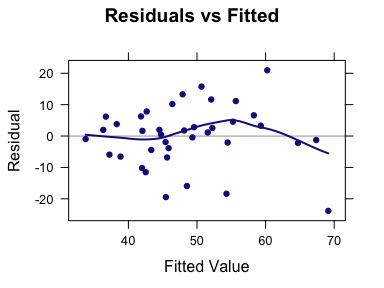
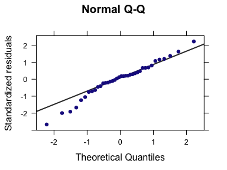

Week 14: Multiple Regression Analysis
================
written by Junvie Pailden

### Load the required packages for this lesson.

``` r
# install the necessary package if it doesn't exist
if (!require(mosaic)) install.packages(`mosaic`)
# load the packages
library(mosaic)
```

Background
----------

The main objective of regression analysis is to model the relationship between one dependent variable `y` and one or more predictor (independent or explanatory) variables. The simple linear regression model covered in Week 12 and Week 13 involves a single independent variable, `y = a + bx + error`. In practice, the relationship between `y` and any predictor variable might not be strong, but knowing the values of several predictor variables may considerably reduce uncertainty about the associated `y` value.

For example, some variation in house prices (`y`) in a large city can be attributed to house size (`x1`), but knowledge of size by itself would not usually enable a bank appraiser to accurately predict a home's value. House price is also determined by other variables, such as age (`x2`), lot size (`x3`), number of bedrooms and bathrooms (`x4`), and distance from schools (`x5`). In other words, we might be able to model house prices with using a regression model with multiple predictors, `y = a + b1x1 + b2x2 + b3x3 + b4x4 + b5x5 + error`.

### Understanding Graduation Rates

Recall the data used in Week's 12 and 13 to model the six-year graduation rate (%) using the predictors student-related expenditure per full-time student, and median SAT score for the 38 primarily undergraduate public universities and colleges in the United States with enrollments between 10,000 and 20,000.

``` r
gradrates <- read.csv("https://www.siue.edu/~jpailde/gradrates.csv")
str(gradrates)
xyplot(Graduation.Rate ~ Expenditure, 
       data = gradrates,
       type = c("p", "r"))
xyplot(Graduation.Rate ~ Median.SAT, 
       data = gradrates,
       type = c("p", "r"))
```

    # 'data.frame': 38 obs. of  3 variables:
    #  $ Graduation.Rate: num  81.2 66.8 66.4 66.1 64.9 63.7 62.6 62.5 61.2 59.8 ...
    #  $ Expenditure    : int  7462 7310 6959 8810 7657 8063 8352 7789 8106 7776 ...
    #  $ Median.SAT     : int  1160 1115 1070 1205 1135 1060 1130 1200 1015 1100 ...


Fitting a multiple regression model in R is similar to simple linear regression only with the addition of extra predictors using `+` sign. In this example, we include both student related expenditure per full time student (`Expenditure`) and median SAT score (`Median.SAT`) as predictors.

``` r
model3 <- lm(Graduation.Rate ~ Expenditure + Median.SAT, 
       data = gradrates)
model3
# 
# Call:
# lm(formula = Graduation.Rate ~ Expenditure + Median.SAT, data = gradrates)
# 
# Coefficients:
# (Intercept)  Expenditure   Median.SAT  
#   -65.43028      0.00214      0.09459
confint(model3, level = 0.95)
#                 2.5 %    97.5 %
# (Intercept) -1.10e+02 -21.15072
# Expenditure -1.66e-03   0.00593
# Median.SAT   5.20e-02   0.13720
```

We can similarly construct confidence intervals for the slopes (or effects) of multiple predictors. In this example, we constructed 95% confidence intervals for the slope of `Expenditure` and `Median.SAT`. Notice that the confidence interval estimate of `Expenditure` contains zero which suggests that `Expenditure` could plausibly have no effect on graduation rates. On the other hand, `Median.SAT` clearly have a positive effect on graduation rates as indicated by the interval (0.050, 0.137). Similar inferences on the slopes can be observed if we change the level of significance to 90% and 99%, respectively.

Model Prediction
----------------

Aside from describing the relationship between the dependent variable and its predictors, we can also use the estimated regression model to predict the dependent variable of a given observation with reasonable predictor values (i.e., within the data range of the predictor values).

For example, consider two colleges with the following predictor values.

| College | `Expenditure` | `Median.SAT` |
|---------|---------------|--------------|
| `A`     | 7000          | 1000         |
| `B`     | 8500          | 1200         |

Using the `predict` function in R, we can estimate the predicted value of graduation rates of these colleges. The associated prediction intervals are also provided in the output.

``` r
predict(model3, interval = "prediction",
        level = 0.95,
        newdata = data.frame(Expenditure = c(7000, 8500),
                             Median.SAT = c(1000, 1200)))
#    fit  lwr  upr
# 1 44.1 23.6 64.6
# 2 66.2 44.7 87.7
```

We estimate the graduation rate of college A as 44.1% (23.6%, 64.6%) while the graduate rate of college B as 66.2% (44.7%, 87.7%).

Model Assumptions
-----------------

We covered model residuals in Week 13. A similar analogue can be computed or visualized for multiple linear regression.

``` r
# residual plot
mplot(model3, which = 1)
# [[1]]
```



``` r
# QQ-plot
mplot(model3, which = 2)
# [[1]]
```



The residual plot showed that the residuals are closer to zero for colleges/universities with low graduation rates. The variance (spread) of the residuals seems to increase as the graduates rates increase. Although this suggest violation of the equal variance model assumption, this anomaly might only be due to the small sample size (`n = 38`) in the data. Similar observation can be stated when viewing the model QQplot. Multiple regression model is fairly robust (still valid) to slight deviations in model assumptions.

Model Usefulness
----------------

As in simple linear regression, the sum of the squared residuals `SSRed` is the basis for several important summary quantities that tell us the about the model's usefulness.

1.  Residual Standard Error, `se(sigma)`, or root MSE
2.  Multiple R-squared (or Coefficient of Multiple Determination), `R2`
3.  Adjusted R-squared, `adj-R2`
4.  F-statistic

In general, a useful model is one that results in both a large `R2` value and a small `se(sigma)` value. This essentially means that the model was successful in explaining (or accounting) the variation in the dependent variable `y` using the predictors in the data set.

However, we must be careful since `R2` will increase (and `se(sigma)` decrease) when fitting large number of predictors in the model. Alternatively, we use `adj-R2` (instead of `R2`) to check the quality of the model when fitting multiple predictors since `adj-R2` will not usually increase with the number of predictors.

The model utility F-test for multiple regression test the null hypothesis that all the predictor slopes are zero against the alternative that at least one is zero. Basically, the null hypothesis in the F-test says that there is no useful relationship between the dependent variable `y` and any other predictors. The value of the `F-statistic` is large when at least one slope is not 0 (model captures variation in `y`) than when all the slopes are zero. The associated p-value for this test is also given in the summary output.

``` r
# model quality summary
msummary(model3)
#              Estimate Std. Error t value Pr(>|t|)    
# (Intercept) -65.43028   21.81143   -3.00    0.005 ** 
# Expenditure   0.00214    0.00187    1.14    0.261    
# Median.SAT    0.09459    0.02099    4.51    7e-05 ***
# 
# Residual standard error: 9.91 on 35 degrees of freedom
# Multiple R-squared:  0.442,   Adjusted R-squared:  0.41 
# F-statistic: 13.9 on 2 and 35 DF,  p-value: 3.65e-05
```

The first part of the `msummary` output reports the summary for model coefficients. The second part reports the model quality output. The residual residual error or root MSE is 9.91, `R2` is 0.44, and `adj-R2` is 0.41. This means that 44% of the variation in graduation rates was explained by the model containing `Expenditure` and `Median.SAT`. Since the value of `R2` is moderately large and the residual standard error is not too large, we can say that the chosen model is somewhat successful in relating graduation rates to the given predictors. The relative large computed `F-statistic` and small p-value also supports this inference.

------------------------------------------------------------------------
