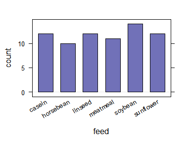
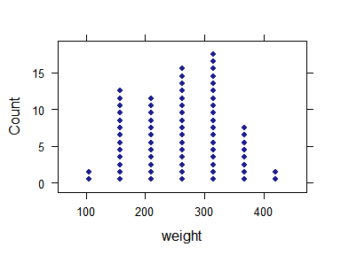
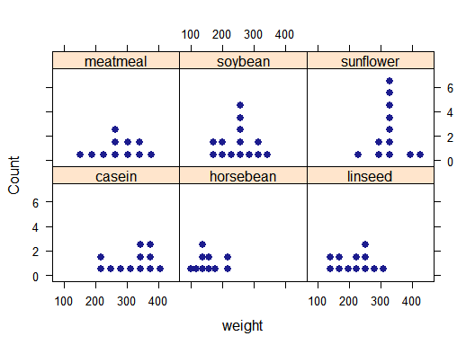
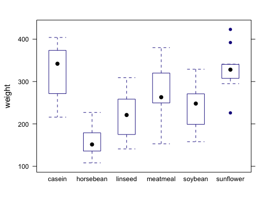
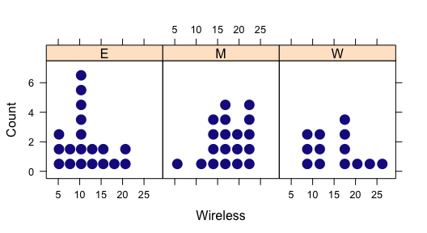
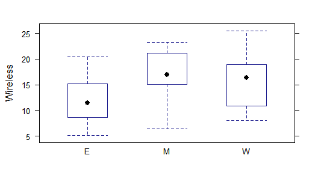
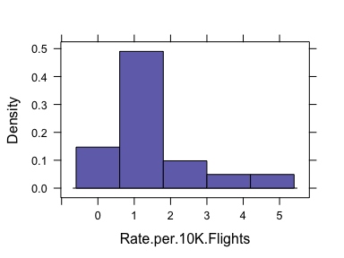
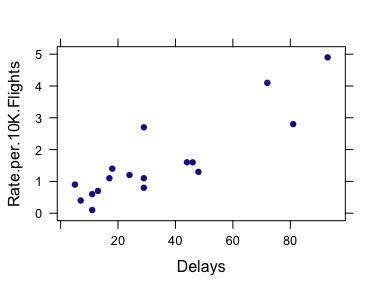

Week 3: Numerical and Graphical Summary
================
written by Junvie Pailden

### Mosaic package

The `mosaic` package was written to simplify the use of R for introductory statistics courses. A short summary of the R needed to teach introductory statistics can be found in the mosaic package vignettes (<http://cran.r-project.org/web/packages/mosaic>).

``` r
install.packages(`mosaic`)
library(mosaic)
```

Numerical Summaries
-------------------

Recall the data set `chickwts` in the package `datasets` included with every R installation. We can compute the mean of the `weight` variable in the data `chickwts`.

``` r
mean(~ weight, data = chickwts)
# [1] 261
```

The `mean` function in the `mosaic` package supports formula interface common to regression and anova models (more on this later). The same output can be obtained using `$` notation.

``` r
mean(chickwts$weight)
# [1] 261
```

We can also tally the count or frequency of various feed supplements.

``` r
tally(~ feed, data = chickwts)
# feed
#    casein horsebean   linseed  meatmeal   soybean sunflower 
#        12        10        12        11        14        12
```

The formula interface allows us to compute the mean weight for every feed supplements.

``` r
mean(weight ~ feed, data = chickwts)
#    casein horsebean   linseed  meatmeal   soybean sunflower 
#       324       160       219       277       246       329
```

You can also compute other numerical summaries such as the `median()`, variance `var()`, standard deviation `sd()`, etc.

Another handy function in the `mosaic` package is `favstats` which outputs the

-   five-number summary
-   mean
-   standard deviation
-   count
-   number missing values

``` r
favstats(~ weight, data = chickwts)
#  min  Q1 median  Q3 max mean   sd  n missing
#  108 204    258 324 423  261 78.1 71       0
favstats(weight ~ feed, data = chickwts)
#        feed min  Q1 median  Q3 max mean   sd  n missing
# 1    casein 216 277    342 371 404  324 64.4 12       0
# 2 horsebean 108 137    152 176 227  160 38.6 10       0
# 3   linseed 141 178    221 258 309  219 52.2 12       0
# 4  meatmeal 153 250    263 320 380  277 64.9 11       0
# 5   soybean 158 207    248 270 329  246 54.1 14       0
# 6 sunflower 226 313    328 340 423  329 48.8 12       0
```

Graphical Summaries
-------------------

The `mosaic` package also includes commands for common graphical summaries.

Bargraph for Categorical Variables

``` r
bargraph(~ feed, data = chickwts)
```



Dot Plots are used often to describe small size numerical data sets.

``` r
dotPlot(~ weight, data = chickwts)
```



Similarly, Stem Plots are also used to describe small size numerical data sets.

``` r
stem(chickwts$weight)
# 
#   The decimal point is 2 digit(s) to the right of the |
# 
#   1 | 124444
#   1 | 5566777889
#   2 | 00112223333444
#   2 | 5556666667778
#   3 | 0001222222333334444
#   3 | 5678899
#   4 | 02
```

Histograms are used often to describe moderate to large size numerical data sets.

``` r
histogram(~ weight, data = chickwts)
```


### Formula Interface

The formula interface syntax is used for graphical summaries, numerical summaries, and inference procedures.

> `goal(y ~ x | z,  data = ..., groups = ...)`

For plots,

-   `y`: y-axis variable

-   `x`: x-axis variable

-   `z`: z-axis variable

-   `groups`: conditioning variable (overlaid graphs)

Dotplots for `weight` across different `feed` panels.

``` r
dotPlot(~ weight | feed, data = chickwts, cex = 0.8) # reduce the size of the dots by 20%
```

 Boxplots for `weights` by different `feeds` in the same panel.

``` r
bwplot(weight ~ feed, data = chickwts)
```



Going Wireless Data
-------------------

Consider the Going Wireless Data from the previous week.

``` r
wireless.data <- read.csv("http://siue.edu/~jpailde/data/s244/Ex0125.csv", header = TRUE)
```

Descriptive summaries for the Going Wireless data

``` r
favstats(~ Wireless, data = wireless.data)
#  min   Q1 median Q3  max mean   sd  n missing
#  5.1 10.8   15.2 19 25.5 14.8 5.34 51       0
favstats(Wireless ~ Region, data = wireless.data)
#   Region min    Q1 median   Q3  max mean   sd  n missing
# 1      E 5.1  8.65   11.4 15.2 20.6 11.9 4.59 19       0
# 2      M 6.4 15.10   16.9 21.1 23.2 17.4 4.55 19       0
# 3      W 8.0 10.80   16.3 18.9 25.5 15.3 5.66 13       0
```

Graphical summaries for the Going Wireless data

``` r
histogram(~ Wireless | Region, data = wireless.data, width = 3) # histogram bin width = 3
```



``` r
bwplot(Wireless ~ Region, data = wireless.data) # boxplots
```



Data on flight delays on the tarmac
-----------------------------------

Recall the fligh delays data from last week's session.

``` r
getwd() # no arguments needed
# [1] "/Users/JPMac/Dropbox/rstatlab/rstatlab"
delay <- read.csv("Ex0127.csv", header = TRUE)
favstats(~ Rate.per.10K.Flights, data = delay)
#  min  Q1 median  Q3 max mean  sd  n missing
#  0.1 0.8    1.2 1.6 4.9 1.61 1.3 17       0
histogram(~ Rate.per.10K.Flights, data = delay)
```



Scatterplot with `Delays` on the horizontal axis and `Rate.per.10K.Flights` on the vertical axis.

``` r
xyplot(Rate.per.10K.Flights ~ Delays, data = delay)
```



------------------------------------------------------------------------

Laboratory Exercise for Week 3 (10 points)
==========================================

*Directions*:

-   Download this week's exercise file and open the file using RStudio. Right click the link and "Save as..." to your desktop. (&lt;&gt;)
-   This file type is called RMarkdown and is used widely to share and collaborate R outputs. More information is found on this link (<http://rmarkdown.rstudio.com/articles_docx.html>).
-   All R codes should be written inside code chunks. Check (<http://rmarkdown.rstudio.com/authoring_rcodechunks.html>).
-   Submit your completed laboratory exercise using Blackboard's Turnitin feature. Your Turnitin upload link is found on your Blackboard Course shell under the Laboratory folder.

1.  The `RailTrail` dataset within the `mosaic` package includes the counts of crossings of a rail trail in Northampton, Massachusetts for 90 days in 2005. City officials are interested in understanding usage of the trail network, and how it changes as a function of temperature and day of the week.

<!-- -->

1.  Check the structure of the`RailTrail`.

2.  How many variables and observations are in the data set?

3.  Which variables are `integer` type?

4.  Display the first 4 rows of the `RailTrail`.

\#\# Code chunk

``` r
# Insert your code for this question after this line
```

1.  Calculate the mean and standard deviation of the variable `avgtemp`.

\#\# Code chunk

``` r
# Insert your code for this question after this line
```
