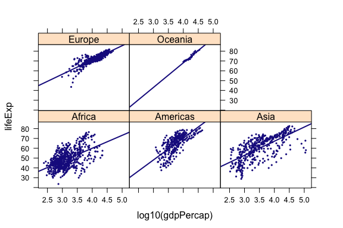
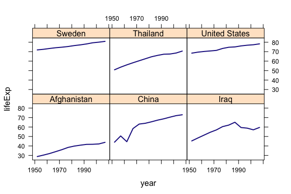
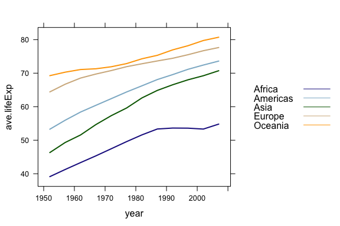

Week 4: Data Management
================
written by Junvie Pailden

### Load the packages mosaic, dplyr, and gapminder package.

``` r
install.packages(`mosaic`)
install.packages(`dplyr`)
install.packages(`gapminder`)
library(mosaic)
library(dplyr)
library(gapminder)
```

The dplyr package provide a collection of convenient "verbs" for manipulating data frames. It aims to provide a function for each basic verb of data manipulation:

-   `filter()` to select cases based on their values.
-   `arrange()` to reorder the cases.
-   `select()` and `rename()` to select variables based on their names.
-   `mutate()` and `transmute()` to add new variables that are functions of existing variables.
-   `summarise()` to condense multiple values to a single value.
-   `sample_n()` and `sample_frac()` to take random samples.

Each dplyr verb takes a data frame as input and returns a modified version of it.

### Gapminder Data

The Gapminder package contains data on life expectancy, GDP per capita, and population by country. The main data frame `gapminder` has 1704 rows and 6 variables. Check `?gapminder` for more information on the data set.

The `gapminder` data frame is a special kind of data frame: a tibble. Compared to a `data.frame`, tibbles have a refined print method that shows the first 10 rows and columns that fit on the screen - useful when working with moderate to large data sets.

``` r
dim(gapminder)
# [1] 1704    6
gapminder
# # A tibble: 1,704 x 6
#        country continent  year lifeExp      pop gdpPercap
#         <fctr>    <fctr> <int>   <dbl>    <int>     <dbl>
#  1 Afghanistan      Asia  1952  28.801  8425333  779.4453
#  2 Afghanistan      Asia  1957  30.332  9240934  820.8530
#  3 Afghanistan      Asia  1962  31.997 10267083  853.1007
#  4 Afghanistan      Asia  1967  34.020 11537966  836.1971
#  5 Afghanistan      Asia  1972  36.088 13079460  739.9811
#  6 Afghanistan      Asia  1977  38.438 14880372  786.1134
#  7 Afghanistan      Asia  1982  39.854 12881816  978.0114
#  8 Afghanistan      Asia  1987  40.822 13867957  852.3959
#  9 Afghanistan      Asia  1992  41.674 16317921  649.3414
# 10 Afghanistan      Asia  1997  41.763 22227415  635.3414
# # ... with 1,694 more rows
```

A quick visualization of the data confirms a widely accepted observation that GDP per capital is positive correlated to life expectancy.

``` r
xyplot( lifeExp ~ log10(gdpPercap) | continent, # separate panels for continent
        data = gapminder,
        cex = 0.4, # shrink the points
        type = c("p", "r")) # fit a regression line on top of the points
```



``` r
        lwd = 3 # set line width
```

### Use `filter()` to select rows in a data frame

`filter()` takes logical expressions and returns the rows for which all are TRUE. The first argument is the name of the data frame. The second and subsequent arguments are the expressions that filter the data frame.

For example, we can select all countries with the following arguments

-   life expectancy below 30 yrs
-   United States for years &gt; 1990
-   selected countries and years &gt; 2000

``` r
filter(gapminder, lifeExp < 30)
# # A tibble: 2 x 6
#       country continent  year lifeExp     pop gdpPercap
#        <fctr>    <fctr> <int>   <dbl>   <int>     <dbl>
# 1 Afghanistan      Asia  1952  28.801 8425333  779.4453
# 2      Rwanda    Africa  1992  23.599 7290203  737.0686

filter(gapminder, country == "United States", year > 1990)
# # A tibble: 4 x 6
#         country continent  year lifeExp       pop gdpPercap
#          <fctr>    <fctr> <int>   <dbl>     <int>     <dbl>
# 1 United States  Americas  1992  76.090 256894189  32003.93
# 2 United States  Americas  1997  76.810 272911760  35767.43
# 3 United States  Americas  2002  77.310 287675526  39097.10
# 4 United States  Americas  2007  78.242 301139947  42951.65

filter(gapminder, country %in% c("Rwanda", "United States", "Japan"), year > 2000)
# # A tibble: 6 x 6
#         country continent  year lifeExp       pop  gdpPercap
#          <fctr>    <fctr> <int>   <dbl>     <int>      <dbl>
# 1         Japan      Asia  2002  82.000 127065841 28604.5919
# 2         Japan      Asia  2007  82.603 127467972 31656.0681
# 3        Rwanda    Africa  2002  43.413   7852401   785.6538
# 4        Rwanda    Africa  2007  46.242   8860588   863.0885
# 5 United States  Americas  2002  77.310 287675526 39097.0995
# 6 United States  Americas  2007  78.242 301139947 42951.6531
```

### Use `slice()` to select rows by position

``` r
slice(gapminder, 1:8)
# # A tibble: 8 x 6
#       country continent  year lifeExp      pop gdpPercap
#        <fctr>    <fctr> <int>   <dbl>    <int>     <dbl>
# 1 Afghanistan      Asia  1952  28.801  8425333  779.4453
# 2 Afghanistan      Asia  1957  30.332  9240934  820.8530
# 3 Afghanistan      Asia  1962  31.997 10267083  853.1007
# 4 Afghanistan      Asia  1967  34.020 11537966  836.1971
# 5 Afghanistan      Asia  1972  36.088 13079460  739.9811
# 6 Afghanistan      Asia  1977  38.438 14880372  786.1134
# 7 Afghanistan      Asia  1982  39.854 12881816  978.0114
# 8 Afghanistan      Asia  1987  40.822 13867957  852.3959
```

### Use `arrange()` to sort data

`arrange()` works similarly to `filter()` except that instead of filtering or selecting rows, it reorders them.

To arrange `gapminder` in ascending order of life expectancy.

``` r
arrange(gapminder, lifeExp)
# # A tibble: 1,704 x 6
#         country continent  year lifeExp     pop gdpPercap
#          <fctr>    <fctr> <int>   <dbl>   <int>     <dbl>
#  1       Rwanda    Africa  1992  23.599 7290203  737.0686
#  2  Afghanistan      Asia  1952  28.801 8425333  779.4453
#  3       Gambia    Africa  1952  30.000  284320  485.2307
#  4       Angola    Africa  1952  30.015 4232095 3520.6103
#  5 Sierra Leone    Africa  1952  30.331 2143249  879.7877
#  6  Afghanistan      Asia  1957  30.332 9240934  820.8530
#  7     Cambodia      Asia  1977  31.220 6978607  524.9722
#  8   Mozambique    Africa  1952  31.286 6446316  468.5260
#  9 Sierra Leone    Africa  1957  31.570 2295678 1004.4844
# 10 Burkina Faso    Africa  1952  31.975 4469979  543.2552
# # ... with 1,694 more rows

# Use `desc()` to order a column in descending order:

arrange(gapminder, desc(lifeExp))
# # A tibble: 1,704 x 6
#             country continent  year lifeExp       pop gdpPercap
#              <fctr>    <fctr> <int>   <dbl>     <int>     <dbl>
#  1            Japan      Asia  2007  82.603 127467972  31656.07
#  2 Hong Kong, China      Asia  2007  82.208   6980412  39724.98
#  3            Japan      Asia  2002  82.000 127065841  28604.59
#  4          Iceland    Europe  2007  81.757    301931  36180.79
#  5      Switzerland    Europe  2007  81.701   7554661  37506.42
#  6 Hong Kong, China      Asia  2002  81.495   6762476  30209.02
#  7        Australia   Oceania  2007  81.235  20434176  34435.37
#  8            Spain    Europe  2007  80.941  40448191  28821.06
#  9           Sweden    Europe  2007  80.884   9031088  33859.75
# 10           Israel      Asia  2007  80.745   6426679  25523.28
# # ... with 1,694 more rows
```

### Use `select()` to select specific variables or columns

When you are only interested in a few columns, use `select()` to quickly narrow down a subset using operations that only work on numeric variable positions.

``` r
# Select columns population and life expectancy by name
select(gapminder, lifeExp, pop)
# # A tibble: 1,704 x 2
#    lifeExp      pop
#      <dbl>    <int>
#  1  28.801  8425333
#  2  30.332  9240934
#  3  31.997 10267083
#  4  34.020 11537966
#  5  36.088 13079460
#  6  38.438 14880372
#  7  39.854 12881816
#  8  40.822 13867957
#  9  41.674 16317921
# 10  41.763 22227415
# # ... with 1,694 more rows

# Select all columns from year to population
select(gapminder, year:gdpPercap)
# # A tibble: 1,704 x 4
#     year lifeExp      pop gdpPercap
#    <int>   <dbl>    <int>     <dbl>
#  1  1952  28.801  8425333  779.4453
#  2  1957  30.332  9240934  820.8530
#  3  1962  31.997 10267083  853.1007
#  4  1967  34.020 11537966  836.1971
#  5  1972  36.088 13079460  739.9811
#  6  1977  38.438 14880372  786.1134
#  7  1982  39.854 12881816  978.0114
#  8  1987  40.822 13867957  852.3959
#  9  1992  41.674 16317921  649.3414
# 10  1997  41.763 22227415  635.3414
# # ... with 1,694 more rows

# Select all columns except those from year to population
select(gapminder, -(year:gdpPercap))
# # A tibble: 1,704 x 2
#        country continent
#         <fctr>    <fctr>
#  1 Afghanistan      Asia
#  2 Afghanistan      Asia
#  3 Afghanistan      Asia
#  4 Afghanistan      Asia
#  5 Afghanistan      Asia
#  6 Afghanistan      Asia
#  7 Afghanistan      Asia
#  8 Afghanistan      Asia
#  9 Afghanistan      Asia
# 10 Afghanistan      Asia
# # ... with 1,694 more rows
```

You can also rename variables with `select()` by using named arguments.

``` r
select(gapminder, life_expectancy = lifeExp)
# # A tibble: 1,704 x 1
#    life_expectancy
#              <dbl>
#  1          28.801
#  2          30.332
#  3          31.997
#  4          34.020
#  5          36.088
#  6          38.438
#  7          39.854
#  8          40.822
#  9          41.674
# 10          41.763
# # ... with 1,694 more rows
```

But because `select()` drops all the variables not explicitly mentioned, it's not often useful. Instead, use `rename()`

``` r
rename(gapminder, life_expectancy = lifeExp)
# # A tibble: 1,704 x 6
#        country continent  year life_expectancy      pop gdpPercap
#         <fctr>    <fctr> <int>           <dbl>    <int>     <dbl>
#  1 Afghanistan      Asia  1952          28.801  8425333  779.4453
#  2 Afghanistan      Asia  1957          30.332  9240934  820.8530
#  3 Afghanistan      Asia  1962          31.997 10267083  853.1007
#  4 Afghanistan      Asia  1967          34.020 11537966  836.1971
#  5 Afghanistan      Asia  1972          36.088 13079460  739.9811
#  6 Afghanistan      Asia  1977          38.438 14880372  786.1134
#  7 Afghanistan      Asia  1982          39.854 12881816  978.0114
#  8 Afghanistan      Asia  1987          40.822 13867957  852.3959
#  9 Afghanistan      Asia  1992          41.674 16317921  649.3414
# 10 Afghanistan      Asia  1997          41.763 22227415  635.3414
# # ... with 1,694 more rows
```

### Use `distinct()` to find unique values in a column

``` r
distinct(gapminder, continent)
# # A tibble: 5 x 1
#   continent
#      <fctr>
# 1      Asia
# 2    Europe
# 3    Africa
# 4  Americas
# 5   Oceania

distinct(gapminder, country, continent)
# # A tibble: 142 x 2
#        country continent
#         <fctr>    <fctr>
#  1 Afghanistan      Asia
#  2     Albania    Europe
#  3     Algeria    Africa
#  4      Angola    Africa
#  5   Argentina  Americas
#  6   Australia   Oceania
#  7     Austria    Europe
#  8     Bahrain      Asia
#  9  Bangladesh      Asia
# 10     Belgium    Europe
# # ... with 132 more rows
```

### Use the pipe operator `%>%` for efficiency

We often want to string together a series of dplyr functions. This is achieved using dplyr's pipe operator, `%>%`. This takes the value on the left, and passes it as the first argument to the function call on the right.

``` r
# input         +--------+        +--------+        +--------+      result
#  data   %>%   |  verb  |  %>%   |  verb  |  %>%   |  verb  |  ->   data
#   frame       +--------+        +--------+        +--------+        frame
```

Say we want to extract the data for Rwanda, but only for selected variables.

``` r
gapminder %>%
  filter(country == "Rwanda", year > 1980) %>%
  select(year, lifeExp)
# # A tibble: 6 x 2
#    year lifeExp
#   <int>   <dbl>
# 1  1982  46.218
# 2  1987  44.020
# 3  1992  23.599
# 4  1997  36.087
# 5  2002  43.413
# 6  2007  46.242
```

### Use `mutate()` to add new variables

Suppose we wanted to recover each country's GDP. The Gapminder data has a variable for population and GDP per capita so we only need to multiply them together.

``` r
gapminder %>%
  mutate(gdp = pop * gdpPercap) %>%
  select(country, year, gdp)
# # A tibble: 1,704 x 3
#        country  year         gdp
#         <fctr> <int>       <dbl>
#  1 Afghanistan  1952  6567086330
#  2 Afghanistan  1957  7585448670
#  3 Afghanistan  1962  8758855797
#  4 Afghanistan  1967  9648014150
#  5 Afghanistan  1972  9678553274
#  6 Afghanistan  1977 11697659231
#  7 Afghanistan  1982 12598563401
#  8 Afghanistan  1987 11820990309
#  9 Afghanistan  1992 10595901589
# 10 Afghanistan  1997 14121995875
# # ... with 1,694 more rows
```

### Use `summarise()` to compute a numerical summary of the data

`summarise()` collapses a data frame to a single row according to some summary measure (e.g. `mean`).

If we are interested to compute the average life expectancy in the data set.

``` r
gapminder %>%
  summarise(ave.lifeExp = mean(lifeExp))
# # A tibble: 1 x 1
#   ave.lifeExp
#         <dbl>
# 1    59.47444
```

### Use `group_by()` to add extra structure

We can use `group_by()` to get the life expectancy of selected (`filter()`) countries across time.

``` r
countryS <- c("United States", "Sweden", "Thailand", "China", "Iraq", "Afghanistan")

compare.lifeExp <- gapminder %>%
  filter(country %in% countryS) %>%
  group_by(year, country) 

compare.lifeExp
# # A tibble: 72 x 6
# # Groups:   year, country [72]
#        country continent  year lifeExp      pop gdpPercap
#         <fctr>    <fctr> <int>   <dbl>    <int>     <dbl>
#  1 Afghanistan      Asia  1952  28.801  8425333  779.4453
#  2 Afghanistan      Asia  1957  30.332  9240934  820.8530
#  3 Afghanistan      Asia  1962  31.997 10267083  853.1007
#  4 Afghanistan      Asia  1967  34.020 11537966  836.1971
#  5 Afghanistan      Asia  1972  36.088 13079460  739.9811
#  6 Afghanistan      Asia  1977  38.438 14880372  786.1134
#  7 Afghanistan      Asia  1982  39.854 12881816  978.0114
#  8 Afghanistan      Asia  1987  40.822 13867957  852.3959
#  9 Afghanistan      Asia  1992  41.674 16317921  649.3414
# 10 Afghanistan      Asia  1997  41.763 22227415  635.3414
# # ... with 62 more rows

xyplot(lifeExp ~ year | country, # separate panels the selected countries
       data = compare.lifeExp,
       type = "l") # line type) 
```



We can also pipe `group_by()` and `summarise()` to get the average life expectancy grouped by year and continent.

``` r
continent.lifeExp <- gapminder %>%
  group_by(year, continent) %>%
  summarise(ave.lifeExp = mean(lifeExp))

continent.lifeExp
# # A tibble: 60 x 3
# # Groups:   year [?]
#     year continent ave.lifeExp
#    <int>    <fctr>       <dbl>
#  1  1952    Africa    39.13550
#  2  1952  Americas    53.27984
#  3  1952      Asia    46.31439
#  4  1952    Europe    64.40850
#  5  1952   Oceania    69.25500
#  6  1957    Africa    41.26635
#  7  1957  Americas    55.96028
#  8  1957      Asia    49.31854
#  9  1957    Europe    66.70307
# 10  1957   Oceania    70.29500
# # ... with 50 more rows

xyplot(ave.lifeExp ~ year, 
       groups = continent, # separate lines for the continents
       data = continent.lifeExp,
       type = "l", # line type
       lwd = 2, # set line width
       auto.key = list(space = "right", # place legend on the right
                       points = FALSE, # omit point in legend
                       lines = TRUE))
```



### Randomly sample rows with `sample_n()` and `sample_frac()`

You can use `sample_n()` and `sample_frac()` to take a random sample of rows: use `sample_n()` for a fixed number and `sample_frac()` for a fixed fraction.

``` r
sample_n(gapminder, 10) # randomly sample 10 rows
# # A tibble: 10 x 6
#                  country continent  year lifeExp      pop  gdpPercap
#                   <fctr>    <fctr> <int>   <dbl>    <int>      <dbl>
#  1               Lebanon      Asia  1962  62.094  1886848  5714.5606
#  2               Liberia    Africa  2007  45.678  3193942   414.5073
#  3          South Africa    Africa  1977  55.527 27129932  8028.6514
#  4                Serbia    Europe  1987  71.218  9230783 15870.8785
#  5              Bulgaria    Europe  1972  70.900  8576200  6597.4944
#  6               Jamaica  Americas  1952  58.530  1426095  2898.5309
#  7              Tanzania    Africa  1952  41.215  8322925   716.6501
#  8                Jordan      Asia  1957  45.669   746559  1886.0806
#  9 Sao Tome and Principe    Africa  1982  60.351    98593  1890.2181
# 10               Tunisia    Africa  1997  71.973  9231669  4876.7986

sample_frac(gapminder, 0.01) # randomly sample 1% of the data
# # A tibble: 17 x 6
#                     country continent  year lifeExp       pop  gdpPercap
#                      <fctr>    <fctr> <int>   <dbl>     <int>      <dbl>
#  1              Afghanistan      Asia  1987  40.822  13867957   852.3959
#  2                   Malawi    Africa  2007  48.303  13327079   759.3499
#  3                 Malaysia      Asia  1977  65.256  12845381  3827.9216
#  4                   Brazil  Americas  1992  67.057 155975974  6950.2830
#  5                  Vietnam      Asia  1987  62.820  62826491   820.7994
#  6           Czech Republic    Europe  1972  70.290   9862158 13108.4536
#  7                   Taiwan      Asia  1952  58.500   8550362  1206.9479
#  8         Hong Kong, China      Asia  1997  80.000   6495918 28377.6322
#  9                   Taiwan      Asia  2002  76.990  22454239 23235.4233
# 10                   Gambia    Africa  1967  35.857    439593   734.7829
# 11                  Germany    Europe  1982  73.800  78335266 22031.5327
# 12 Central African Republic    Africa  1967  41.478   1733638  1136.0566
# 13         Hong Kong, China      Asia  1982  75.450   5264500 14560.5305
# 14    Sao Tome and Principe    Africa  1957  48.945     61325   860.7369
# 15                   Turkey    Europe  1957  48.079  25670939  2218.7543
# 16                 Paraguay  Americas  1967  64.951   2287985  2299.3763
# 17                   Sweden    Europe  2007  80.884   9031088 33859.7484
```

Use `replace = TRUE` to perform random selection with replacement. More on this next week.

------------------------------------------------------------------------
