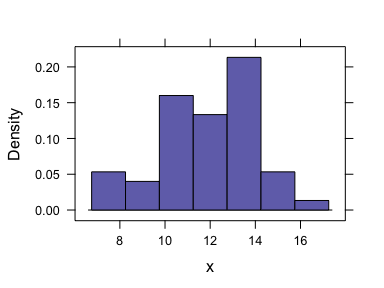
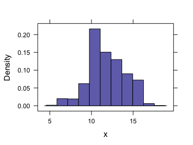
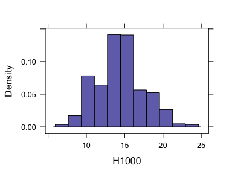
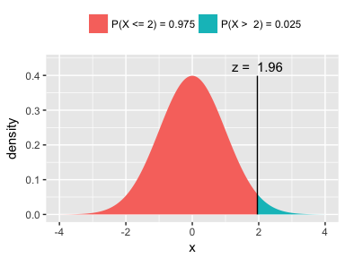
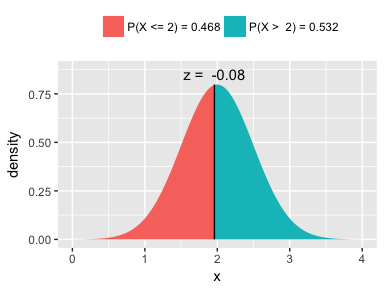
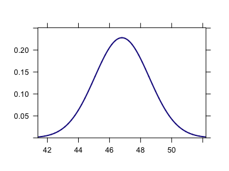
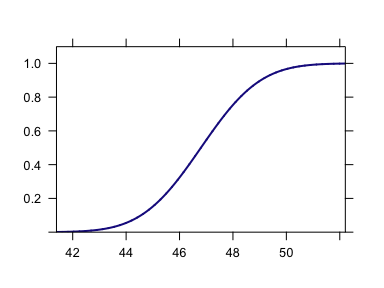

Week 6: Probability Models in R
================
written by Junvie Pailden

### Load the required package for this lesson.

``` r
library(mosaic) # load the package mosaic
```

Calculations involving the Binomial Distribution
------------------------------------------------

The Binomial distribution is often used to model the behavior of finite or countable variables (discrete random variables). In particular, we say that a variable *X* follows the binomial model if *X* counts the number of success in *n* repeated trials. Each trial should be independent and the success probability is fixed at *p*. For example, when tossing a balanced coin 20 times (or tossing 20 similar coins), the variable *X* that counts the number of heads in 20 tosses follows the binomial model with success probability *p* = 0.5

We can simulate a binomial experiment and generate the value of the binomial random variable. For example, consider a bias coin with success (head) probability `Pr(Head) = 0.60` for each trial (toss). We can use R to simulate an experiment tossing this bias coin 20 times. The random variable `X` counts the number of success (heads) in 20 trials (tosses).

To generate an outcome from this experiment, we use the `rbinom()` function with parameters `size` = number of observations, and `prob` = probability of success. The argument `n = 1` is of observations we generate. For example, if we generate one random variable value from `Binomial(size = 20, prob = 0.6)`, we have

``` r
# generated number of success in 20 trials
rbinom(n = 1, size = 20, prob = 0.6)
# [1] 15
```

We can generate multiple random variable values, say `n = 50`, from the same family `Binomial(size = 20, prob = 0.6)`.

``` r
(x <- rbinom(n = 50, size = 20, prob = 0.6)) # generate 50 values
#  [1] 15 15 12 11  9 14 14 12 14 15 14 10  8 13 15 13 14 14 12 10 12 11 13
# [24] 10 11 15 12 10 10 12 11 13 13 15 13 11 13 11 11 11 10 13 10 12 11 11
# [47] 13  9  9 12
histogram(x) # plot a histogram of the generated values
```



``` r
x <- rbinom(n = 1000, size = 20, prob = 0.6) # generate 1000 values
histogram(x)
```



### Jose Altuva's Hitting Average in 2017

As of September 16, 2017, Jose Altuva's hitting average was registered at .347. If we think of this value as Altuva's true hitting average (it's late in the regular season so its safe to have this assumption), then we can simulate the Altuva's hitting performance using the Binomial distribution. Say we want to simulate his number of hits in the next 40 at bats (AB).

``` r
(H1 <- rbinom(n = 1, size = 40, prob = 0.357)) # generate 1 possible number of hits in the next 20 games
# [1] 18
H1000 <- rbinom(n = 1000, size = 40, prob = 0.357) # generate 1000 possible number of hits in the next 20 games
tally(H1000)
# X
#   4   6   7   8   9  10  11  12  13  14  15  16  17  18  19  20  21  22 
#   1   4   7  15  23  49  72  94 117 138 135 109  82  66  42  24  15   4 
#  23  24 
#   2   1
favstats(H1000)
#  min Q1 median Q3 max mean   sd    n missing
#    4 12     14 16  24 14.4 3.02 1000       0
histogram(H1000)
```



From the generated histogram we can say that Altuva's number of hits is most likely between 10 or 20 in the next 40 at bats (AB).

We can compute the probability that Jose Altuva will hit a given number (or range) of hits. This is the same as computing the Binomial Probability (Mass) Function value. We can find probability that Altuva will get 15 hits in the next 40 at bats (AB) by using the base function `dbinom`.

``` r
# prob'y that Altuva will get 15 hits in the next 40 at bats
dbinom(x = 15, size = 40, prob = 0.357) # 12.6% chance
# [1] 0.126
```

If we want to compute the probability that Altuva will get either from 14 or 15 hits.

``` r
# prob'y that Altuva will get either 14 or 15 hits in the next 40 at bats
dbinom(x = 14, size = 40, prob = 0.357) + dbinom(x = 15, size = 40, prob = 0.357)
# [1] 0.257
```

We can also use Binomial's Cumulative Distribution Function (CDF), `pbinom()`, to compute probability of wider ranges of hits (x).

``` r
# prob'y that Altuva will get at most 15 hits
pbinom(q = 15, size = 40, prob = 0.357) # 66% chance
# [1] 0.661
# probaby that Altuva will get more than 15 hits
1 - pbinom(q = 15, size = 40, prob = 0.357) # 33.9% chance 
# [1] 0.339
# probaby that Altuva will get anywhere from 14 to 17 hits
pbinom(q = 17, size = 40, prob = 0.357) - pbinom(q = 13, size = 40, prob = 0.357) # 45% chance
# [1] 0.451
# note that the second term is the CDF value at 13 and not at 14, why?
```

### Probability Function Displays

The `plotDist()` can be used to display distributions in a variety of ways.

``` r
# Jose Altuva's probability distribution of hits in the next 40 at bats
plotDist('binom', size = 40, prob = 0.357)
```


``` r
# Jose Altuva's cumulative distribution of hits in the next 40 at bats
plotDist('binom', size = 40, prob = 0.357, kind = 'cdf')
```


------------------------------------------------------------------------

Calculations involving the Normal Distribution
----------------------------------------------

Normal distributions are widely used to model the behavior of continuous measurements (variables). The histogram of a normally distributed measurement is usually symmetric and bell-shape. Every normal distribution is the same except for two numbers: these numbers are the `mean` (center) and standard deviation (spread) `sd`.

A standard normal distribution is one with `mean = 0` and `sd = 1`. The graph below describes the area representing the probability that the standard normal variable *Z* is below 1.96.

    # 
    # If X ~ N(0, 1), then
    #   P(X <= 1.96) = P(Z <= 1.96) = 0.975
    #   P(X >  1.96) = P(Z >  1.96) = 0.025
    # 



    # [1] 0.975

On the other hand, if we have a normal random variable *X* with `mean = 2` and standard deviation `sd = 0.5`, then the graph below describes the area representing the probability that this normal variable *X* is below 1.96.

    # 
    # If X ~ N(2, 0.5), then
    #   P(X <= 1.96) = P(Z <= -0.08) = 0.4681
    #   P(X >  1.96) = P(Z >  -0.08) = 0.5319
    # 



    # [1] 0.468

To generate a sample from any normal distribution, we use the `rnorm` function with arguments: sample size `n`, `mean`, and `sd`. Let's generate 100 values from a standard normal distribution and plot a histogram.

``` r
# 100 generated values from standard normal dist
z <- rnorm(n = 100, mean = 0, sd = 1)
z[1:20] # first 20 values
#  [1]  1.47783 -1.45545  0.05823 -0.08953  0.22831  1.09509 -0.07409
#  [8]  1.89706  0.00805  0.86003  1.44508 -0.13667  0.05425 -0.34193
# [15]  0.88113  0.28428  0.26341  0.72973  0.25211  0.77620
favstats(z) # summary statistics
#    min     Q1 median    Q3  max  mean   sd   n missing
#  -2.58 -0.433 0.0562 0.444 2.33 0.088 0.93 100       0
histogram(z) # symmetric bell-shaped histogram
```


### Normal Probability Calculations

Mopeds (small motorcycles) are very popular in Europe because of their mobility, ease of operation, and low cost. The article in this [link](http://journals.sagepub.com/doi/abs/10.1243/09544070JAUTO714) described a test for determining the maximum vehicle speed for mopeds. A normal distribution with mean value 46.8 km/h and standard deviation 1.75 km/h is postulated.

``` r
# probability density function
plotDist('norm', mean = 46.8, sd = 1.75)
```



``` r
# cumulative distribution function
plotDist('norm', mean = 46.8, sd = 1.75, kind = 'cdf')
```



The probability that the maximum speed is at most 50 km/h can be computed in R using the `pnorm` function. We have

``` r
# Pr(X < = 50) = Pr(X < 50) 
pnorm(q = 50, mean = 46.8, sd = 1.75)
# [1] 0.966
```

> For any continuous variables `X`, `Pr(X = c) = 0`. So `Pr(X <= c) = Pr(X < c)`.

Also, the probability that the maximum speed is at least 48 km/h is

``` r
# Pr(X > 48) = 1 - Pr(X < 48) 
1 - pnorm(q = 50, mean = 46.8, sd = 1.75)
# [1] 0.0337
```

We can also find the probability that the maximum speed is between 47 and 49 km/h

``` r
# Pr(47 < X < 49) = Pr(X < 49) - Pr(X < 47)
pnorm(q = 49, mean = 46.8, sd = 1.75) - pnorm(47, mean = 46.8, sd = 1.75)
# [1] 0.35
```

The function `qnorm` computes the *p*-th percentile (or quantile) of the normal distribution. For example, the 40th percentile of the standard normal is the value of *z*<sub>0</sub> such that *P*(*Z* &lt; *z*<sub>0</sub>)=0.40.

``` r
qnorm(p = 0.40, mean = 0, sd = 1)
# [1] -0.253
```

In the mopeds example above, the cut-off for the top 10% (or 90th percentile) of all maximum speeds is 49 km/h.

``` r
qnorm( p = 0.90, mean = 46.8, sd = 1.75  )
# [1] 49
```

------------------------------------------------------------------------

### Family of Probability Distributions

The previous discussions outlines how `R` calculate quantities related to the discrete Binomial distribution and the continuous Normal distribution. We can, in fact, do the same calculation for any family of probability distributions.

For a comprehensive list, see [Statistical Distributions](https://en.wikibooks.org/wiki/R_Programming/Probability_Distributions) on the R wiki. The functions available for each distribution follow this format:

| function name | description                                  |
|---------------|----------------------------------------------|
| `dname( )`    | compute density or probability mass function |
| `pname( )`    | compute cumulative distribution function     |
| `qname( )`    | find percentiles/quantiles                   |
| `rname( )`    | generate random draws                        |

------------------------------------------------------------------------
