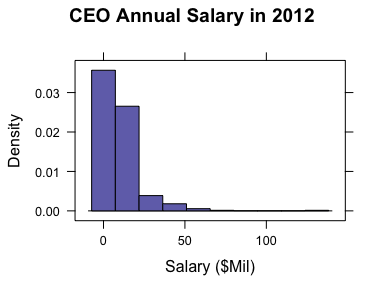
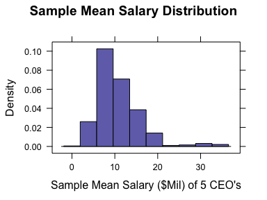
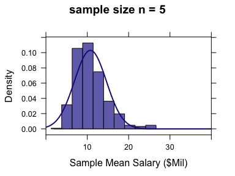
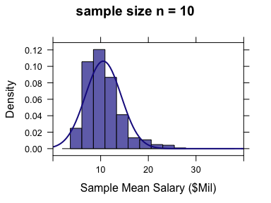
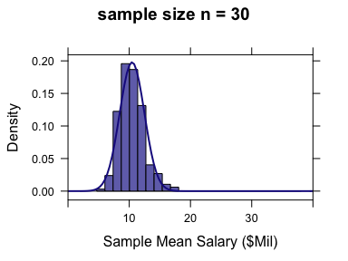
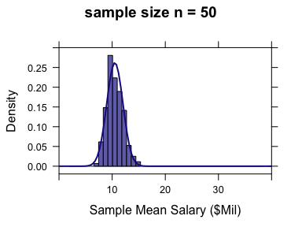
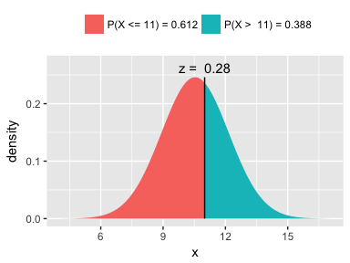
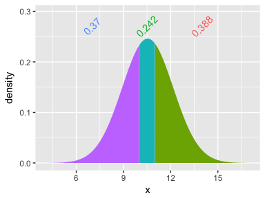

Week 7: Sampling Distribution of the Sample Mean
================
written by Junvie Pailden

### Load the required package for this lesson.

``` r
library(mosaic) # load the package mosaic
```

Statistics and Sampling Variability
-----------------------------------

> Statistic: A quantity computed from values in a sample.

Given a sample from a population, a statistic can be the sample mean, sample proportion, or sample standard deviation computed from this sample.

> Sampling Variability: The observed value of a statistic depends on the particular sample selected from the population and it will vary from sample to sample. This variability is called sampling variability.

### Example: Exploring Sampling Variability

Consider the data set `CEO_Salary_2012.csv` containing the annual salary (in $Million) information of 497 CEO's in 2012. The data is from the book Stats: Data and Models (2014) by De Veaux, Velleman, and Bock.

For this lesson, let's consider the data `CEO_Salary_2012.csv` as population data of 497 CEO's annual salary.

``` r
ceo_salary <- read.csv("https://www.siue.edu/~jpailde/CEO_Salary_2012.csv")
str(ceo_salary)
# 'data.frame': 497 obs. of  5 variables:
#  $ Rank      : int  1 2 3 4 5 6 7 8 9 10 ...
#  $ Name      : Factor w/ 497 levels "A Greig Woodring",..: 227 367 321 375 74 126 198 426 46 216 ...
#  $ Company   : Factor w/ 497 levels "3M","Abbott Laboratories",..: 300 381 469 266 234 179 368 453 289 210 ...
#  $ Annual.pay: num  131.2 66.7 64.4 60.9 55.8 ...
#  $ Age       : int  53 72 55 67 59 57 55 59 61 60 ...
head(ceo_salary)
#   Rank                 Name         Company Annual.pay Age
# 1    1    John H Hammergren        McKesson      131.2  53
# 2    2         Ralph Lauren    Ralph Lauren       66.7  72
# 3    3 Michael D Fascitelli  Vornado Realty       64.4  55
# 4    4     Richard D Kinder   Kinder Morgan       60.9  67
# 5    5         David M Cote       Honeywell       55.8  59
# 6    6           George Paz Express Scripts       51.5  57
```

The main variable we are interested is `Annual.pay` which is the 1 Year Pay ($Million) of the 497 CEO's in this population. The shape of the population salary histogram is skewed to the right meaning that some CEO's have very large salaries compared to the rest.

``` r
histogram(~ Annual.pay, data = ceo_salary, 
          main = "CEO Annual Salary in 2012", 
          xlab = "Salary ($Mil)")
```



The population salary mean is $10.539 Mil and population salary standard deviation is $11.468 Mil.

``` r
(mu <- mean(~ Annual.pay, data = ceo_salary))
# [1] 10.5
(sigma <- sd(~ Annual.pay, data = ceo_salary))
# [1] 11.5
favstats(~ Annual.pay, data = ceo_salary)
#   min   Q1 median   Q3 max mean   sd   n missing
#  0.16 3.91   6.97 13.4 131 10.5 11.5 497       0
```

Let us select a random sample of 5 CEO's from this population and compute the sample mean salary.

``` r
# randomly select rows without replacement using `sample_n`
(samp1 <- sample_n(ceo_salary, size = 5)) 
#     Rank               Name                                 Company
# 130  130 Richard H Anderson                         Delta Air Lines
# 486  486   Wendy C Waugaman American Equity Investment Life Holding
# 137  137       Leonard Bell                 Alexion Pharmaceuticals
# 247  247  Brian Duperreault                    Marsh & McLennan Cos
# 303  303    Mark S McAndrew                               Torchmark
#     Annual.pay Age
# 130     13.175  56
# 486      0.915  51
# 137     12.715  53
# 247      7.045  64
# 303      5.600  61
(xbar1 <- mean(~ Annual.pay, data = samp1))
# [1] 7.89
```

The sample mean salary of $7.89 Mil for the 5 CEO's selected in sample 1 is different from the population mean salary $10.539 Mil by about $-2.649 Mil.

Is this difference in sample mean salary common, or is this particular sample mean salary unusually far away from the true mean? Taking more samples will provide some additional insight.

``` r
(samp2 <- sample_n(ceo_salary, size = 5))
#     Rank            Name          Company Annual.pay Age
# 252  252 Wendell P Weeks          Corning       6.93  52
# 193  193    John F Coyne  Western Digital       9.06  62
# 311  311 Robert Greifeld Nasdaq OMX Group       5.25  54
# 134  134      Hugh Grant         Monsanto      12.84  54
# 429  428   John P Jumper             SAIC       2.75  67
(xbar2 <- mean(~ Annual.pay, data = samp2))
# [1] 7.37
(samp3 <- sample_n(ceo_salary, size = 5))
#     Rank             Name               Company Annual.pay Age
# 454  454  Edward J Bonach         CNO Financial       2.08  58
# 304  304    Harold G Hamm Continental Resources       5.50  66
# 318  318   Dennis R Glass      Lincoln National       5.04  62
# 118  118 Scott A McGregor              Broadcom      14.01  56
# 95    95    James J Mulva        ConocoPhillips      15.62  65
(xbar3 <- mean(~ Annual.pay, data = samp3))
# [1] 8.45
```

Let us repeat this process of selecting a random sample and computing the sample mean 500 times. The `do()` function in the `mosaic` package repeats some operation many times, and collects the results in a data frame.

``` r
simulated.means <- do(500)*mean(~ Annual.pay,
  data = sample_n(ceo_salary, size = 5))
# data frame containing the 500 computed sample means
head(simulated.means)
#    mean
# 1 12.88
# 2  3.70
# 3 16.25
# 4 15.76
# 5  6.26
# 6  6.97
# mean of the sample means
(mu.xbar <- mean(~ mean, data = simulated.means))
# [1] 10.5
# standard deviaton of the sample means
(std.xbar <- sd(~ mean, data = simulated.means))
# [1] 4.76
# histogram of the sample means
histogram(~ mean, data = simulated.means, 
          main = "Sample Mean Salary Distribution", 
          xlab = "Sample Mean Salary ($Mil) of 5 CEO's")
```



The figure above is a density histogram of the 500 sample mean salaries computed from 500 samples each of size n = 5. This histogram provides insight about the behavior of sample mean salary. For a sample of size n = 5, the shape of the density histogram of the sample mean salary is skewed to the right similar to, although not as pronounced, as the density histogram of the population salary.

> Sampling distribution: The distribution that would be formed by considering the value of a sample statistic for every possible different sample of a given size from a population.

The center of the sample mean distribution 10.491 is very close to the value of the population mean salary 10.539.

``` r
# true mean, and average of the sample means
c(mu, mu.xbar)
# [1] 10.5 10.5
# true standard deviation, and standard deviation of the sample means
c(sigma, std.xbar)
# [1] 11.47  4.76
sigma/sqrt(5)
# [1] 5.13
```

Most samples resulted in a sample mean salary that are reasonably near the true mean salary 10.539, falling between 5.411 and 15.667.

------------------------------------------------------------------------

Sampling Distribution of a Sample Mean
--------------------------------------

In the discussion above, we say the shape of the sampling distribution of the mean when the sample size is n = 5 is close the shape of the distribution of the original population. What happens to the shape of the sampling distribution if we increase the sample size from *n* = 5 to *n* = 50?

The figures below displays density histograms for the sample mean based on 500 samples from the data `ceo_salary`, each consisting of n observations where *n* = 5, *n* = 10, *n* = 30, and *n* = 50.



First, notice that the skewness of the sampling distribution disappeared as the sample size increases to 50. In fact, the density histograms for *n* = 30 and *n* = 50 are approximately normal in shape.

Second, the sampling distribution of the four histograms are centered at the true population mean at 10.539.

Third, the spread of the sampling distribution as represented by width of the histograms have decreases when the sample size increased.

We can summarize the second and third observations with the following relationships

> average of the sample mean = true sample mean

> standard deviation of the sample mean = standard deviation / sqrt (sample size)

The standard deviation of the sample means

| sample size | standard deviation of the sample mean |
|-------------|---------------------------------------|
| 1           | 11.468                                |
| 5           | 5.128                                 |
| 10          | 3.626                                 |
| 30          | 2.094                                 |
| 50          | 1.622                                 |

Properties of the Sampling Distribution of the Mean
---------------------------------------------------

When the sample means are computed from randomly selected samples, we have the following properties

1.  The average of the sample means is the true sample mean.

2.  The standard deviation of the sample means is the true standard deviation divided by the square root of the sample mean.

3.  If the original population is normal, the sampling distribution of the sample mean is also normal.

4.  **Central Limit Theorem**: If the sample size *n* is sufficiently large, the sampling distribution of the sample mean can be approximated by the normal distribution.

------------------------------------------------------------------------

Although the population salary distribution is not normal, we can perform normal probability calculations involving the sample mean salary by relying on the properties of the sampling distribution when the sample size is sufficiently large. The usual cut-off for a large sample size is *n* = 30.

When a sample of 50 CEO's is randomly selected from the data `ceo_salary`, we can compute the following:

    i) probability that the sample mean salary is below $11 Mil

``` r
# divide the original standard deviotion by sqrt(50)
pnorm(q = 11, mean = mu, sd = sigma/sqrt(50))
# [1] 0.612
xpnorm(q = 11, mean = mu, sd = sigma/sqrt(50))
# 
# If X ~ N(10.54, 1.622), then
#   P(X <= 11) = P(Z <= 0.2842) = 0.6119
#   P(X >  11) = P(Z >  0.2842) = 0.3881
# 
```



    # [1] 0.612

    ii) probability that the sample mean salary is between \$10 Mil and \$11 Mil.

``` r
pnorm(q = 11, mean = mu, sd = sigma/sqrt(50)) - pnorm(q = 10, mean = mu, sd = sigma/sqrt(50))
# [1] 0.242
xpnorm(q = c(10, 11), mean = mu, sd = sigma/sqrt(50))
# 
# If X ~ N(10.54, 1.622), then
#   P(X <= 10) = P(Z <= -0.3324) = 0.3698   P(X <= 11) = P(Z <=  0.2842) = 0.6119
#   P(X >  10) = P(Z >  -0.3324) = 0.6302   P(X >  11) = P(Z >   0.2842) = 0.3881
# 
```



    # [1] 0.370 0.612

------------------------------------------------------------------------
