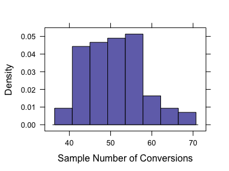
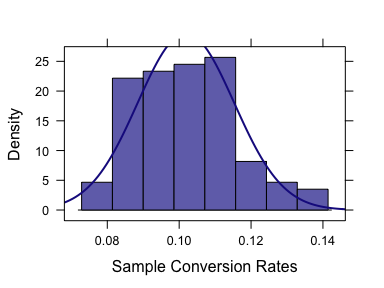
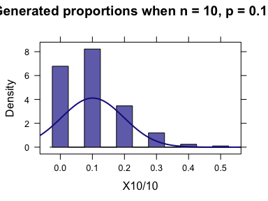
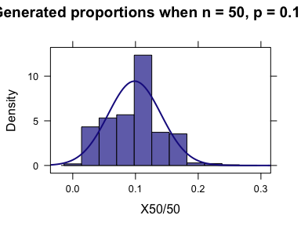
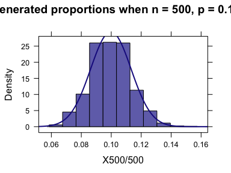
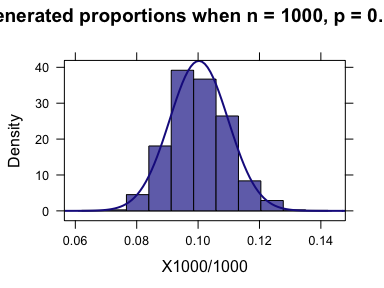

Week 8: Sample Proportion and Confidence Intervals
================
written by Junvie Pailden

### Load the required package for this lesson.

``` r
library(mosaic) # load the package mosaic
```

Sample Proportion and Conversion Rates
--------------------------------------

Suppose you are in-charge of managing your new accounts by monitoring your company's website. Last weeks traffic registered 500 visitors to your company's website but only 40 signed up for a new account.

Although the conversion (new account) rate for last week's traffic is is .09 (45/500), its possible that the true conversion rate will be different from this number.

Last week's conversion rate is what we call as a **sample proportion** and the true conversion rate is what we call as **population proportion**.

> A `point estimate` is a single number based on the data and represents a plausible value of a population characteristic.

The sample proportion is a `point estimate` of the population proportion.

Let `X` be the number of conversions (new accounts) out of `n` number of website visits. We can assume that `X` follows the binomial distribution `Binom(n,p)` with `p` as the true conversion rate ([see Week 6 for Binomial Distribution](https://github.com/jpailden/rstatlab/blob/master/week6.md)).

We also define `X/n` as the sample conversion rate (sample proportion).

Let us run a simulation experiment by randomly generating 500 visits and counting the number of conversions (new accounts). This is equivalent to generating 500 draws from the Binomial model `Binom(n,p)` and count the number of success `X`.

The population characteristics of `X` and `X/n` are the given the table below

<table style="width:76%;">
<colgroup>
<col width="19%" />
<col width="20%" />
<col width="20%" />
<col width="15%" />
</colgroup>
<thead>
<tr class="header">
<th><code>random variable</code></th>
<th><code>population mean</code></th>
<th><code>population variance</code></th>
<th><code>population standard deviation</code></th>
</tr>
</thead>
<tbody>
<tr class="odd">
<td><code>X</code></td>
<td><code>np</code></td>
<td><code>np(1-p)</code></td>
<td><code>sqrt(np(1-p))</code></td>
</tr>
<tr class="even">
<td><code>X/n</code></td>
<td><code>p</code></td>
<td><code>p(1-p)/n</code></td>
<td><code>sqrt(p(1-p)/n)</code></td>
</tr>
</tbody>
</table>

For example, suppose that the true conversion rate is `p = 0.10`. Lets draw samples from `Binom(500, 0.10)`.

``` r
# generate 100 binomial random variable values
X1 <- rbinom(100, size = 500, p = 0.10)
histogram(X1, xlab = "Sample Number of Conversions") # histogram of the count X
```



``` r
histogram(X1/500, xlab = "Sample Conversion Rates", fit = "Normal")  # histogram of the sample proportion X/n
```



``` r
mean(~ X1) # sample mean of X
# [1] 51.4
mean(~ X1/500) # sample mean of X/n
# [1] 0.103
sd(~ X1) # sample std deviation of X
# [1] 7.5
sd(~ X1/500) # sample std deviation of X/n
# [1] 0.015
```

In this experiment, the population characteristics of `X` and `X/500`

<table style="width:76%;">
<colgroup>
<col width="19%" />
<col width="20%" />
<col width="20%" />
<col width="15%" />
</colgroup>
<thead>
<tr class="header">
<th><code>random variable</code></th>
<th><code>population mean</code></th>
<th><code>population variance</code></th>
<th><code>population standard deviation</code></th>
</tr>
</thead>
<tbody>
<tr class="odd">
<td><code>X</code></td>
<td>50</td>
<td>45</td>
<td>6.708</td>
</tr>
<tr class="even">
<td><code>X/500</code></td>
<td>0.1</td>
<td>1.810^{-4}</td>
<td>0.013</td>
</tr>
</tbody>
</table>

In the experiment above, the generated values of `X` (number of conversions) and `X/500` (conversion rates) can be considered as point estimates of the population characteristics (parameters) `np = 50` and `p = 0.10`, respectively.

In fact, notice that the generated values of `X` (number of conversions) and `X/500` (conversion rates) are distributed (or centered) around `np = 50` and `p = 0.10`, respectively.

In addition, the shape of the sampling distribution of `X/n` is symmetric bell-shape. This pattern is more pronounce when the value of `n` is large.

------------------------------------------------------------------------

Confidence Intervals for the Population Proportion
--------------------------------------------------

As an alternative to a point estimate, we can use the sample data to report an interval of plausible values for the population characteristic.

For example, we can be confident that for a weekly traffic of 500, the true conversion rate `p` (if we don't know this) is in the interval from 0.06 to 0.12. The width of this interval reflects the how precise the information we have about the value of `p`.

If we rather have the interval .01 to .30 as the plausible interval for `p` then it reflects how imprecise the knowledge we have about the value of `p`.

> A confidence interval is a interval of plausible values for a population characteristic (e.g. population proportion, population mean).

> A confidence interval is constructed so that we have a chosen degree of confidence (confidence level) that the actual value of the population characteristic will be between the lower and upper endpoints of the interval.

As mentioned above, the sampling distribution of `X/n` can be approximated by a normal distribution when `n` is sufficiently large, say when both `np >= 10` and `n(1-p) >= 10`.



When `n` is large, approximately 95% of all random samples of size `n` will result in a value of sample proportion `X/n` that is within `1.96 * sqrt(p(1-p)/n)` of the actual value of the population proportion `p`.

In most studies, the value of `p` is unknown, hence the population standard deviation `sqrt(p(1-p)/n)` is also unknown. As long as the sample size is large, we can estimate `sqrt(p(1-p)/n)` by replacing `p` with `phat = X/n`.

> The quantity `1.96 * sqrt(phat(1-hat)/n)` is often called the standard error when constructing 95% confidence intervals for the true proportion `p`.

------------------------------------------------------------------------

In the original example above, the conversion (new account) rate for last week's traffic is is .09 (45/500) with `n = 500`. We can use this information to construct a 95% confidence interval for the true conversion rate `p`.

``` r
n <- 500 # website visits
phat  <- 45/500 # 45 new accounts 
std.error <- 1.96*sqrt(phat*(1-phat)/n) # standard error
# 95% confidence interval for the true conversion rate
data.frame(LL = phat - std.error, UL = phat + std.error)
#       LL    UL
# 1 0.0649 0.115
```

We can also use the function `prop.test()` in R to compute the 95% confidence levels for the population proportion.

``` r
prop.test(x = 45, n = 500, conf.level = 0.95)
# 
#   1-sample proportions test with continuity correction
# 
# data:  45 out of 500
# X-squared = 300, df = 1, p-value <2e-16
# alternative hypothesis: true p is not equal to 0.5
# 95 percent confidence interval:
#  0.0671 0.1194
# sample estimates:
#    p 
# 0.09
```

------------------------------------------------------------------------
