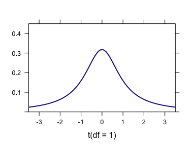
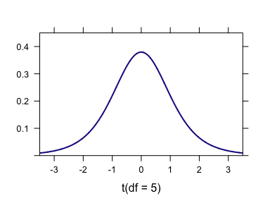
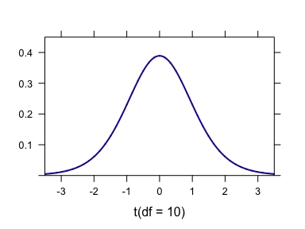
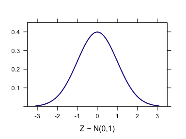
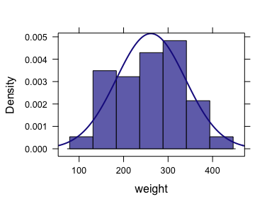
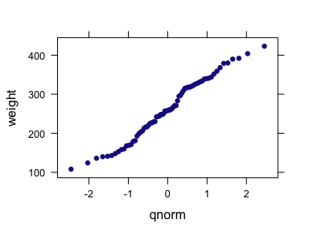

Week 9: Inference About the Single Mean
================
written by Junvie Pailden

### Load the required package for this lesson.

``` r
library(mosaic) # load the package mosaic
```

Inference on a Single Mean (One Population)
-------------------------------------------

Last week we look at estimating the true proportion of conversion rates (new website accounts) by constructing confidence interval estimates. It is also important to estimate the average time visitors browse the website. To do this, we need to look at inferential methods on the mean.

Let `X1, X2, ..., Xn` be the observations recorded as a random sample of size `n` from a normal population `N(mu, sigma)` with unknown mean `mu` and unknown standard deviation `sigma`. The statistic

`T = sqrt(n)(Xbar - mu)/S`

has a `t` distribution with `n-1` degrees of freedom, where `Xbar` is sample average and `S` is the sample variance.

### What is a `t`-distribution?

A `t`-distribution is very similar in shape to the standard normal distribution (`Z ~ N(0,1)`) in the sense that both distributions are bell shaped and centered at zero. The degrees of freedom (`df`) of a `t`-distribution is the unique parameter that determines the spread of the t-distribution. As the number of degrees increases, the spread of the corresponding `t`-distribution decreases and its shape will approach the shape of the standard normal distribution.



### Using `t.test` function

Consider the data set `chickwts` we first used in Week 3. The data set contains two variables: `weight` = weights of the chicks, `feed` = type of feeds. Suppose we wish to test the hypothesis that true mean weight is 270 grams. First lest start by describing the sample using numerical measures (sample mean, standard deviation, etc.)

``` r
str(chickwts)
# 'data.frame': 71 obs. of  2 variables:
#  $ weight: num  179 160 136 227 217 168 108 124 143 140 ...
#  $ feed  : Factor w/ 6 levels "casein","horsebean",..: 2 2 2 2 2 2 2 2 2 2 ...
favstats(~ weight, data = chickwts)
#  min  Q1 median  Q3 max mean   sd  n missing
#  108 204    258 324 423  261 78.1 71       0
```

The sample mean weight is 261 g with a standard deviation of 78.71 g.

The `R` function `t.test` performs the calculation for the traditional inference procedures for the mean. Before we use `t.test`, we should check if it is reasonable to assume the `weight`'s are normally distributed. We create two plots: histogram and normal QQ (Quantile-Quantile) plot.

A QQ-plot is used to check whether a variable follows a known family of distribution (e.g. normal. A QQ-plot is a scatterplot created by plotting the sample quantile of the variable against the quantile of the reference distribution. If both sets quantiles came from the same distribution, we should see the points forming a line that's roughly straight. The `qqmath` function produces a normal QQ-plot of the variable.

``` r
histogram(~ weight, data = chickwts, fit = "normal")
```



``` r
qqmath(~ weight, data = chickwts)
```



Note from the histogram and QQ-plot that it is indeed reasonable to assume that the data `weigth` is a sample from a Normal distribution.

We use the `t.test` function included in the package `mosaic`. This version of the `t.test` follows formula interface.

    t.test(formula, data, 
          alternative = c("two.sided", "less", "greater"),
          mu = 0, # hypothesized mean
          conf.level = 0.95)

For single sample inference that we consider this week, we use the formula `~ weight` to use access the data variable. We supply the argument `mu = 270` if we wish to test whether the true mean weight is 270. If the alternative hypothesis is two-sided, then we do not supply the argument `alternative` with any value, otherwise we need to set the correct alternative hypothesis direction. We can also set a different confidence level through the argument `conf.level`.

In our example, we are interested in testing the hypothesis that `mu = 270`, the alternative is two-sided (default value), and we wish to construct a 90% confidence interval for `mu`.

``` r
t.test(~ weight, data = chickwts,
       mu = 270,
       conf.level = 0.9)
# ~weight
# 
#   One Sample t-test
# 
# data:  weight
# t = -0.9, df = 70, p-value = 0.4
# alternative hypothesis: true mean is not equal to 270
# 90 percent confidence interval:
#  246 277
# sample estimates:
# mean of x 
#       261
```

The output gives a value of the t-test statistic `T` and the two-sided p-value for testing the hypothesis that `mu = 270`. Since the p-value is large (larger than the level of significance `alpha` usually set at .05), there is insufficient evidence from the data to conclude the mean weight is not equal to 270 grams.

The output also reported the confidence interval estimate (246, 277) for the true mean weight. Note that the hypothesized mean of 270 grams is inside this interval. As covered in the class, we are 90% confident that the interval (246, 277) contains the true mean weight.

The example above on constructing interval estimate for the true mean uses the frequentist approach. Another popular approach, not covered in class, to constructing interval estimates is by using the Bayesian approach.

------------------------------------------------------------------------
